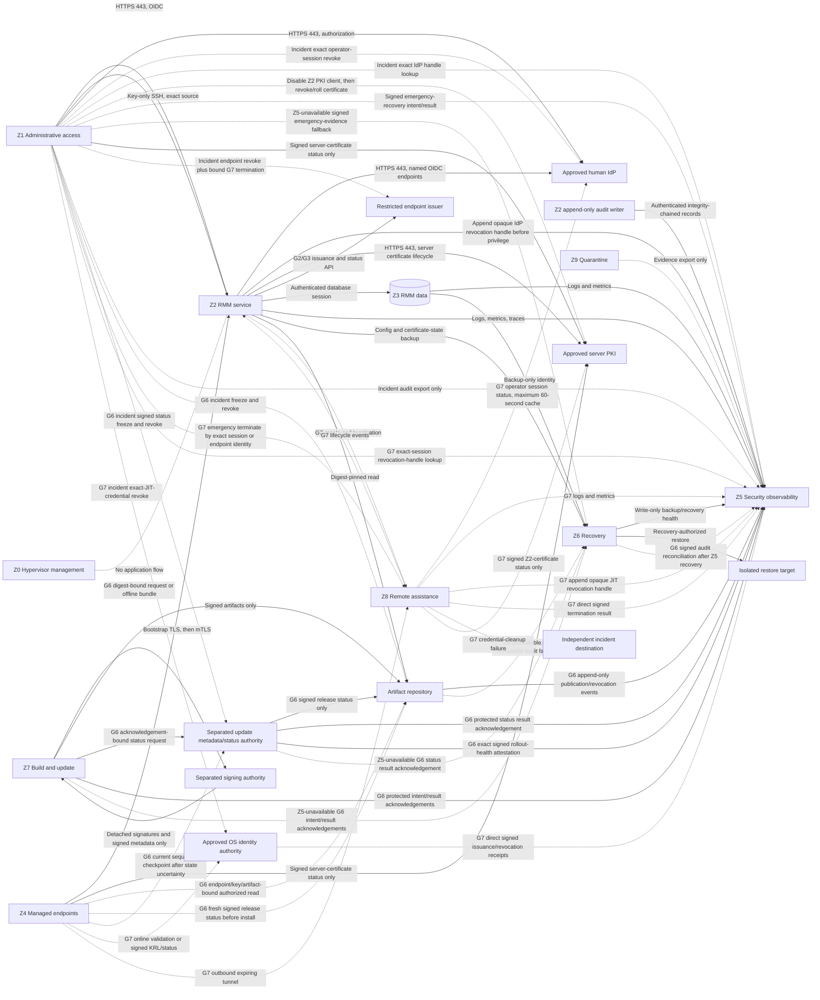

# RMM Infrastructure and Microsegmentation Specification

## Purpose and status

This document defines the infrastructure required to operate NorthGate RMM and
the provisioning controls required to isolate the platform from operators,
managed endpoints, build systems, backups, and future remote-access services.

This is a design and acceptance specification. It does **not** authorize a VM,
VLAN, virtual switch, firewall rule, DNS record, certificate, endpoint agent, or
public listener. Infrastructure deployment remains subject to the phase gates in
[Authorization Gates](../governance/AUTHORIZATION_GATES.md).
The security-significant architecture decision and threat-model delta are recorded
in [ADR 0008](adr/0008-zoned-default-deny-rmm-infrastructure.md) and
[the threat model](../security/THREAT_MODEL.md).

Terminology: this specification covers the NorthGate remote monitoring and
management (**RMM**) platform. It does not describe the NIST Risk Management
Framework, which is commonly abbreviated **RMF**.

## Security basis

Network location is a containment signal, not an identity or authorization
decision. Every permitted flow also requires an authenticated workload, human,
or endpoint identity and a resource-level authorization decision. This follows
the resource-focused model in [NIST SP 800-207](https://csrc.nist.gov/pubs/sp/800/207/final)
and the identity-aware application model in
[NIST SP 800-207A](https://csrc.nist.gov/pubs/sp/800/207/a/final).

The virtual-network design applies segmentation, firewall traffic control, and
traffic monitoring as recommended by
[NIST SP 800-125B](https://csrc.nist.gov/pubs/sp/800/125/b/final). Provisioning is
incremental and evidence-driven, consistent with CISA's
[Microsegmentation in Zero Trust guidance](https://www.cisa.gov/news-events/alerts/2025/07/29/cisa-releases-part-one-zero-trust-microsegmentation-guidance)
and the implementation lessons in
[NIST SP 1800-35](https://csrc.nist.gov/pubs/sp/1800/35/final).

## Design principles

1. Deny traffic by default at routed, guest-host, and application boundaries.
2. Allow only a named source identity to a named destination service and port.
3. Agents initiate outbound connections; endpoints expose no RMM listener.
4. The Hyper-V management plane never shares the RMM application plane.
5. Operator ingress and agent ingress have different authentication, policy,
   rate-limit, and logging paths even when they initially share one VM.
6. PostgreSQL, signing keys, backups, and remote-session credentials are never
   reachable from a managed-endpoint segment.
7. A VLAN or subnet does not grant access. mTLS, OIDC, service credentials, and
   resource authorization remain mandatory.
8. IPv4 and IPv6 receive equivalent policy; an unfiltered secondary protocol is
   a failed deployment.
9. Management access uses the approved NorthGate administrative path, never an
   application listener or endpoint tunnel.
10. Every rule has an owner, purpose, expiry/review date, evidence, and rollback.

## Required platform capabilities

The RMM platform requires the following capabilities. A capability may share the
initial private control-plane VM only where the table permits it.

| Capability                            | Phase 1 placement                   | Separation requirement                                                         |
| ------------------------------------- | ----------------------------------- | ------------------------------------------------------------------------------ |
| Reverse proxy and TLS ingress         | Control-plane VM, private only      | Separate agent and operator routes, policies, and rate limits                  |
| Operator UI and API                   | Control-plane VM                    | Private operator ingress; no endpoint-segment access                           |
| Agent gateway                         | Control-plane VM                    | Distinct service identity and listener policy from UI/API                      |
| Registry, policy, and job modules     | Control-plane VM                    | No direct external listener                                                    |
| Scheduler and workers                 | Control-plane VM                    | Separate runtime identity and least database privilege                         |
| PostgreSQL                            | Local authenticated service         | Dedicated data VM only after measured trust, availability, or capacity trigger |
| Audit writer                          | Control-plane VM                    | Append role plus independent protected copy and incident export before G2      |
| Logs, metrics, and traces             | Local buffer plus central sink      | Central sink must not become an RMM control path                               |
| Endpoint certificate authority        | Offline root plus restricted issuer | Root never resides on the online RMM VM                                        |
| Human identity provider               | Existing approved service           | RMM stores no reusable human password                                          |
| Runtime secret provider               | Host-protected references           | Never embedded in image, Git, logs, URLs, or manifests                         |
| Artifact repository                   | Read-only consumer path             | Build/upload identity remains outside the control plane                        |
| Backup and recovery store             | Separate recovery boundary          | No ordinary application write or delete authority                              |
| Session gateway and credential broker | Absent                              | Dedicated zone and hosts required at G7                                        |
| Build and release signing             | Absent from runtime                 | Dedicated build zone; signing offline or hardware-backed at G6                 |
| Update metadata/status authority      | Absent from runtime                 | Separate constrained signing role and key required at G6                       |

The project deliberately does not require Kubernetes, a service mesh, Redis, or
a separate message broker for the initial lab deployment. PostgreSQL provides the
first durable job queue. Additional infrastructure requires measured need and an
architecture decision record.

## Compute and storage baseline

These values are initial planning envelopes, not production capacity claims.
They must be validated by Phase 1 tests and revised from observed utilization.

| Environment               | Compute                                              | Storage                                        | Intended scope                             |
| ------------------------- | ---------------------------------------------------- | ---------------------------------------------- | ------------------------------------------ |
| Developer workstation     | 2 vCPU, 4 GiB RAM                                    | 40 GiB disposable workspace                    | Synthetic fixtures and tests only          |
| Private lab control plane | 4 vCPU, 8 GiB RAM                                    | 80 GiB OS plus 100 GiB service-data disk       | Phase 1 and one Phase 2/3 canary           |
| Expanded lab              | 4-8 vCPU, 8-16 GiB RAM per measured role             | Separate database, audit, and recovery volumes | Only after a documented separation trigger |
| Production-intent         | Determined by load, recovery, and availability tests | Encrypted, monitored, capacity-managed storage | G8 only; no estimate from lab sizing       |

The control-plane VM must be a Generation 2 VM with Secure Boot where supported,
a virtual TPM when the selected secret-protection design requires it, fixed
asset identity, `destroyProtection: true`, and no checkpoints used as backup.
The preferred server OS is a minimal, currently supported Linux distribution.
Windows and Linux are both managed endpoint platforms; that does not require the
server itself to run on both.

Storage must provide:

- a dedicated service-data volume so database growth cannot exhaust the OS;
- encryption at rest with recovery keys held outside the VM;
- database-consistent backups plus configuration and certificate-state backup;
- capacity alerts before database, audit, spool, or backup failure;
- no shared writable mount between runtime, build, and recovery identities; and
- an isolated restore target for testing revocation and audit invariants.

## Availability and dependency baseline

Before the lab canary is installed, the platform needs:

- authoritative internal DNS with separate operator and agent service names;
- authenticated, monitored time synchronization;
- endpoint PKI with offline root, restricted online issuer, renewal, revocation,
  and documented clock-skew behavior;
- OIDC authentication with phishing-resistant MFA for privileged operators;
- tested database backup and isolated restore;
- central alert delivery that does not depend solely on the failed RMM service;
- a documented emergency-stop and certificate-revocation path; and
- recovery access independent of the normal UI and agent gateway.

Loss of DNS, time, PKI, identity provider, database, or storage must fail closed
for new privileged work and remain observable. Monitoring data may become stale;
the UI must never convert missing data into success.

## Trust zones

Zone names are stable logical roles. Exact VLAN IDs, subnets, switch names, and
IP addresses are deliberately absent until live NorthGate discovery and a
separately approved network-boundary plan establish them.

| Zone                      | Purpose                                      | Permitted residents                                           | Explicitly excluded                             |
| ------------------------- | -------------------------------------------- | ------------------------------------------------------------- | ----------------------------------------------- |
| Z0 Hypervisor management  | Operate HC-HV01 and the VM Factory           | Hypervisor and approved management services                   | RMM workloads, agents, databases                |
| Z1 Administrative access  | Trusted operator entry                       | Hardened admin workstation or jump path                       | Managed endpoints and general user devices      |
| Z2 RMM service            | UI/API and agent gateway ingress             | Private proxy and control-plane runtime                       | Hypervisor management and release signing       |
| Z3 RMM data               | Application database and relational state    | PostgreSQL and dedicated application-data storage             | Operators, endpoints, protected audit archive   |
| Z4 Managed endpoints      | Systems monitored by RMM                     | Approved Windows/Linux canaries, later scoped endpoint groups | Control-plane or management services            |
| Z5 Security observability | Independent telemetry and protected audit    | Approved central sink and append-only protected audit archive | RMM administrative or evidence-delete authority |
| Z6 Recovery               | Backups and isolated restore                 | Backup target and recovery operator path                      | Ordinary runtime write/delete identity          |
| Z7 Build and update       | CI, artifact creation, signing handoff       | Ephemeral builders and artifact publication                   | Production secrets and endpoint reachability    |
| Z8 Remote assistance      | Future session gateway and credential broker | G7-authorized gateway services only                           | Standing routes to endpoint networks            |
| Z9 Quarantine             | Contain suspect or failed assets             | Isolated endpoint or restored copy under investigation        | Normal control-plane and peer reachability      |

Logical zones may initially share physical infrastructure, but enforcement points
must remain distinct. For example, Phase 1 can keep PostgreSQL on the control VM
while a local socket, database role, process identity, and guest firewall preserve
the future Z2-to-Z3 boundary.

## Minimum flow policy

All RMM-created inter-zone and external dependency flows not listed are denied.
Stateful return traffic is part of the initiating row and does not create a
second standing path. “Conditional” means the flow remains prohibited until its
named gate and design evidence exist.

| Source                                   | Destination                                        | Service                       | Status                | Required control                                                                                                                            |
| ---------------------------------------- | -------------------------------------------------- | ----------------------------- | --------------------- | ------------------------------------------------------------------------------------------------------------------------------------------- |
| Z1 admin path                            | Z2 operator ingress                                | TCP 443                       | Required              | OIDC MFA, device/source policy, RBAC, audit                                                                                                 |
| Z1 admin path                            | Z2 control-plane host                              | TCP 22                        | Required              | Exact source; dedicated key-only identity, no password/root login, audit                                                                    |
| Z1 browser                               | Approved human IdP                                 | TCP 443                       | Required              | Authorization endpoint only; TLS and IdP policy                                                                                             |
| Z2 control plane                         | Approved human IdP                                 | TCP 443                       | Required              | OIDC plus signed issuer/tenant/subject/session/client tuple, opaque revocation handle, and current status; cache at most 60 seconds         |
| Z1 identity recovery operator            | Approved human IdP emergency revocation            | TCP 443                       | Incident only         | Independent MFA; revoke exact issuer/tenant/session/client or opaque handle only; no token/user/role/policy authority                       |
| Z2 operator-session registrar            | Z5 protected operator-session evidence             | Approved TLS port             | Required              | Append signed issuer/tenant/subject/session/client binding plus opaque IdP revocation handle; acknowledgement before privilege              |
| Z1 identity recovery operator            | Z5 protected IdP revocation-handle lookup          | TCP 443                       | Incident only         | Independent MFA and case scope; exact RMM session/operator/time query; self-audited bounded handle/issuer result; no enumeration            |
| Z2 control plane                         | Approved endpoint issuer                           | TCP 443                       | G2/G3                 | Workload mTLS; named enrollment, issuance, renewal, revocation/status APIs                                                                  |
| Z1 recovery operator                     | Endpoint issuer emergency revocation               | TCP 443                       | Incident only         | Dedicated MFA identity; revoke exact scope only, no issuance/renewal; terminate every active G7 session bound to the identity or isolate Z8 |
| Z2 TLS service                           | Approved server PKI                                | TCP 443                       | Required              | Authenticated issuance, renewal, revocation/status endpoints only                                                                           |
| Z1 PKI recovery operator                 | Approved server PKI emergency containment          | TCP 443                       | Incident only         | Independent MFA; first disable/rotate exact Z2 issuance-client identity, then revoke/roll exact certificate; no unrelated authority         |
| Z1 security recovery operators           | Z5 protected recovery-audit intake                 | TCP 443                       | Incident only         | Signed intent/result for exact human/certificate/session/tunnel/grant/release scope and outcome                                             |
| Z1 security recovery operators           | Z6 immutable emergency-evidence intake             | Approved evidence protocol    | Z5-unavailable only   | Signed append-only fallback bundle; no restore/delete authority; reconcile to Z5 after recovery                                             |
| Z1 managed TLS client                    | Approved server-PKI status service                 | TCP 443                       | Required              | Signed OCSP/CRL status only; independent of Z2; missing/stale/unknown/revoked fails closed                                                  |
| Z4 endpoint TLS client                   | Approved server-PKI status service                 | TCP 443                       | G2/G3                 | Signed status for exact Z2 certificate; no issuance/revocation API; hard-fail policy                                                        |
| Z8 session gateway TLS client            | Approved server-PKI status service                 | TCP 443                       | G7 conditional        | Signed status for exact Z2 certificate; no issuance/revocation API; hard-fail policy                                                        |
| Z8 session gateway                       | Approved human IdP session-status service          | TCP 443                       | G7 conditional        | Exact issuer/tenant/subject/session/client status from signed grant; cache at most 60 seconds; no token/user admin                          |
| Z4 unenrolled canary                     | Z2 enrollment ingress                              | TCP 443                       | G2/G3                 | Server-authenticated TLS; single-use exact-scope grant, key proof, limits                                                                   |
| Z4 enrolled endpoint                     | Z2 agent ingress                                   | TCP 443                       | G2/G3                 | Outbound mTLS, revocation, endpoint binding, rate and size limits                                                                           |
| Z2 application                           | Z3 PostgreSQL                                      | TCP 5432 or local socket      | Required              | Named workload role, TLS if networked, least SQL privilege                                                                                  |
| Z2 services                              | Z5 telemetry sink                                  | Approved TLS port             | Required              | Write-only service identity and bounded queue                                                                                               |
| Z2 audit writer                          | Z5 protected audit archive                         | Approved TLS port             | Required before G2    | Workload mTLS; append-only integrity-chained records/checkpoints, no read/delete/control authority                                          |
| Z3 data services                         | Z5 telemetry sink                                  | Approved TLS port             | When separated        | Write-only service identity; no RMM control authority                                                                                       |
| Z5 telemetry service                     | Approved alert destination                         | Approved TLS port             | Required              | Named destination, notification-only credential, bounded redacted payload                                                                   |
| Z1 incident auditor                      | Z5 protected audit export                          | TCP 443                       | Incident/audit        | Independent MFA; exact case/time scope; immutable access/export event; no alter/delete                                                      |
| Z3 database backup identity              | Z6 backup target                                   | Approved backup protocol      | Required              | Separate credential, encryption, integrity, immutability/retention                                                                          |
| Z2 backup exporter                       | Z6 backup target                                   | Approved backup protocol      | Required              | Config/certificate-state scope; write-only identity, no delete authority                                                                    |
| Z5 audit archive exporter                | Z6 backup target                                   | Approved backup protocol      | Required              | Audit/checkpoint scope; write-only identity, immutable destination                                                                          |
| Z6 backup/recovery monitor               | Z5 telemetry sink                                  | Approved TLS port             | Required              | Write-only capacity, backup, retention, integrity, and restore-test health; no recovery content                                             |
| Z6 source-record collector               | Approved source/deployment repository              | TCP 443                       | Required              | Read-only exact commit, signed tag, and deployment-manifest scope                                                                           |
| Artifact repository backup identity      | Z6 backup target                                   | Approved backup protocol      | G6                    | Signed packages, metadata, SBOM, provenance, and public keys; write-only immutable recovery copy                                            |
| Z8 metadata exporter                     | Z6 backup target                                   | Approved backup protocol      | G7 conditional        | Encrypted session/gateway metadata only; write-only identity, no delete                                                                     |
| Approved secret-store recovery service   | Dedicated secret recovery target                   | Provider-approved mechanism   | When present          | Separate authority, encryption, audit, retention, and restore test                                                                          |
| Z6 recovery service                      | Isolated restore target                            | Approved restore protocol     | Recovery only         | Exact authorization, no endpoint/operator ingress, reconcile before use                                                                     |
| Z2 runtime                               | Artifact repository                                | TCP 443                       | G6                    | Read-only, signed metadata, digest and expiry verification                                                                                  |
| Z4 enrolled endpoint                     | Artifact repository and update-status endpoint     | TCP 443                       | G6                    | mTLS download authorization plus fresh independently signed release status immediately before install                                       |
| Z4 enrolled endpoint                     | Approved update metadata/status authority          | TCP 443                       | G6 state recovery     | mTLS read-only current signed sequence checkpoint after restart/reinstall/rollback/restore/missing state; no signing/admin authority        |
| Z7 publisher                             | Artifact repository                                | TCP 443                       | G6                    | Separate identity; require valid signing-intent and signing-result intake acknowledgements bound to the artifact                            |
| Approved update metadata/status role     | Artifact repository update-status endpoint         | Approved publication protocol | G6                    | Exact signed status plus current intent/result acknowledgements; repository verifies all; only Z1-authorized restrictive exception          |
| Z7 status coordinator                    | Approved update metadata/status authority          | TCP 443                       | G6                    | Exact request with protected ack, separate signed rollout decision, and applicable signed health-attestation digest                         |
| Approved update metadata/status role     | Z5 rollout-health attestation service              | TCP 443                       | G6 authority increase | Read only exact signed artifact/ring/window/threshold/result/evidence digest; no raw telemetry, audit, or release authority                 |
| Approved update metadata/status role     | Z5 protected release-audit intake                  | Approved TLS port             | G6                    | Append signed status result bound to request/output digest; require acknowledgement before authority-increasing publication                 |
| Approved update metadata/status role     | Z6 immutable release-audit fallback                | Approved evidence protocol    | G6, Z5 unavailable    | Same write-only result and independent acknowledgement; no release, read, restore, or delete authority                                      |
| Z7 release services                      | Z5 protected release-audit intake                  | Approved TLS port             | G6                    | Workload mTLS; append-only decisions/attempts/results, digest-bound, no read/delete/control authority                                       |
| Artifact repository audit emitter        | Z5 protected release-audit intake                  | Approved TLS port             | G6                    | Append-only publish/freeze/revoke events; signed sequence/correlation, no read/delete authority                                             |
| Z7 release services                      | Z6 immutable release-audit fallback                | Approved evidence protocol    | G6, Z5 unavailable    | Write-only signed event; independent acknowledgement before transition; no read/restore/delete authority                                    |
| Artifact repository audit emitter        | Z6 immutable release-audit fallback                | Approved evidence protocol    | G6, Z5 unavailable    | Write-only signed event; independent acknowledgement before transition; no read/restore/delete authority                                    |
| Z6 immutable release-audit reconciler    | Z5 protected release-audit intake                  | Approved TLS port             | Recovery              | Write-only exact accepted event plus original Z6 acknowledgement; no release, read, alter, or delete authority                              |
| Z1 release recovery operator             | Artifact emergency metadata API                    | TCP 443                       | G6 incident           | Independent MFA; freeze/revoke only, offline-root authorization, no upload                                                                  |
| Z1 release recovery operator             | Update metadata/status emergency API               | TCP 443                       | G6 incident           | Independent MFA; publish higher-sequence freeze/revoke status only; no release approval or artifact upload                                  |
| Z2/Z3/Z5/Z6/Z8 host updaters             | Approved OS repositories                           | TCP 443                       | Maintenance           | Separate exact-source rules; named repositories, signatures, change window                                                                  |
| Z7 builder                               | Approved source/dependency registries              | TCP 443                       | G6                    | Read-only locked inputs, digest/provenance checks, no runtime secrets                                                                       |
| Z7 builder                               | Approved CI workload IdP                           | TCP 443                       | G6                    | Ephemeral workload identity with exact audience and short expiry                                                                            |
| Z7 signing coordinator                   | Approved hardware-backed signing service           | TCP 443                       | G6 conditional        | Digest-bound request plus verifiable Z5/Z6 intent acknowledgement; signing policy/quorum; signatures only                                   |
| Z1 recovery path                         | Z6 recovery service                                | Approved admin protocol       | Required              | Recovery role, MFA, reason, alert, evidence                                                                                                 |
| Z1 network recovery operator             | Approved firewall/PEP management                   | Approved admin protocol       | Incident/change       | Independent MFA; exact device and rules, audit, expiry, tested rollback                                                                     |
| Z2 control plane                         | Internal DNS and time                              | UDP/TCP 53; approved NTP      | Required              | Named servers only; monitor failure and drift                                                                                               |
| Z3/Z5/Z6/Z7/Z8 service hosts             | Internal DNS and time                              | UDP/TCP 53; approved NTP      | When present          | Separate exact-source rules to named servers; monitor failure and drift                                                                     |
| Z4 endpoint                              | Internal DNS and time                              | Existing approved services    | G2/G3                 | No new broad route created by RMM                                                                                                           |
| Z1 admin path                            | Z0 hypervisor management                           | Existing approved path        | Existing              | Separate identity; never transits RMM service                                                                                               |
| Z1 browser                               | Z8 session gateway                                 | TCP 443                       | G7 conditional        | Single-use grant, timeout, recording/privacy policy                                                                                         |
| Z1 recovery operator                     | Z8 emergency termination API                       | TCP 443                       | G7 conditional        | Dedicated MFA identity; terminate/revoke exact session or every session bound to an exact revoked endpoint identity; no creation            |
| Z2 control plane                         | Z8 gateway control API                             | TCP 443                       | G7 conditional        | Workload mTLS; signed one-session grant, revoke, and force termination                                                                      |
| Z8 session gateway                       | Z2 event ingress                                   | TCP 443                       | G7 conditional        | Workload mTLS; bounded lifecycle events, no job or policy authority                                                                         |
| Z8 session gateway                       | Z5 protected session evidence                      | Approved TLS port             | G7 conditional        | Direct signed append-only start/activity/termination events with session/grant sequence and correlation                                     |
| Z8 session gateway                       | Z8 credential broker                               | Authenticated IPC or mTLS     | G7 conditional        | One-session retrieval or exact session/grant/handle-bound revocation trigger; no cross-session action                                       |
| Z8 credential broker                     | Approved OS identity authority                     | Approved identity protocol    | G7 conditional        | Issue one session-bound credential; revoke only that credential by returned opaque handle; no list, inspect, policy, or broad revoke        |
| Approved OS identity authority           | Z5 protected session evidence                      | Approved TLS port             | G7 conditional        | Direct signed append-only issuance/revocation receipt with session/grant, opaque handle, expiry; no secret                                  |
| Z8 credential broker                     | Z5 protected session evidence                      | Approved TLS port             | G7 conditional        | Workload mTLS; delivery/cleanup event linked to authority receipt; no credential secret                                                     |
| Z8 credential broker                     | Approved independent incident destination          | Approved TLS port             | G7 failure only       | Signed issuer/opaque handle/session/cleanup state alert; notification only, no credential secret                                            |
| Z1 session recovery operator             | Z5 protected revocation-handle lookup              | TCP 443                       | G7 incident           | Independent MFA; exact session/grant lookup, self-audited; returns opaque handle and issuer only                                            |
| Z1 session recovery operator             | Approved OS identity authority                     | Approved identity protocol    | G7 incident           | Independent MFA; revoke exact issued JIT credential only, no issuance/renewal/policy change                                                 |
| Z4 exact endpoint authentication service | Approved OS identity validation/revocation service | Approved identity protocol    | G7 conditional        | Online validation or signed monotonic KRL/status, maximum 60-second freshness, no issuance authority                                        |
| Z8 session gateway                       | Z5 telemetry sink                                  | Approved TLS port             | G7 conditional        | Write-only security and availability telemetry                                                                                              |
| Z4 exact endpoint                        | Z8 session gateway                                 | Outbound expiring tunnel      | G7 conditional        | Stateful return only; one protocol, port, grant, and expiry                                                                                 |
| Z9 quarantined asset                     | Z5 evidence intake                                 | Approved evidence protocol    | Incident only         | Exact source, write-only bounded export, expiry, malware-safe handling                                                                      |

Every Z1 incident/recovery route uses an identity and credential stored outside
the ordinary RMM control plane and, when the primary IdP is in scope for the
incident, an independently authenticated recovery method. These identities are
disabled or access-restricted when not in use, cannot perform ordinary RMM work,
and require reason, alerting, short expiry, and retrospective review.

### Emergency recovery evidence

Before direct endpoint- or server-certificate revocation/rollover, the Z1 recovery
client signs an intent record containing incident/case, actor, authority, exact
certificate fingerprint/serial and scope, requested action, reason, time, and
correlation ID. The PKI returns a signed result receipt containing the request
digest, authority/key identifier, revocation-status version or replacement public
certificate identifier, outcome, and time. Neither record contains private keys,
authentication tokens, or recovery factors.

For a suspected Z2 TLS service, the recovery order is mandatory: the independent
Z1 PKI recovery operator first disables or rotates the exact PKI client identity
that Z2 uses for issuance and renewal, verifies that the old client can no longer
obtain a certificate, and only then revokes or rolls over the served certificate.
Replacement issuance authority is delivered to a rebuilt/verified Z2 through the
approved secret-provisioning path under a separate recovery decision. The served
TLS certificate and the PKI client credential are different identities.

Before changing the PKI client, Z1 appends signed intent identifying the incident,
actor, authority, exact old client identifier/fingerprint, disable-or-rotate
action, reason, time, and correlation ID. The PKI returns a signed result bound to
the request digest containing the old client's disabled/revoked state and version,
the new public identifier when rotation occurs, and the outcome/digest of a
verified denied issuance attempt by the old client. Z1 appends that result through
the same protected Z5 or immutable Z6 recovery-evidence path before recording the
containment step complete. The bundle contains no client secret or recovery
factor.

Before privileged use, Z2 registers the IdP issuer/tenant and exact signed
subject/session/client tuple in Z5, together with the RMM session correlation and
a non-secret opaque revocation handle accepted by the IdP. Z5 must acknowledge
the append before Z2 enables privileged authority. The handle is protected from
ordinary Z2 read, change, and deletion.

Before emergency human-session revocation, the Z1 identity-recovery client uses a
case-scoped Z5 lookup when responders do not already know the IdP identifiers. It
may query only an exact RMM session or bounded operator/time scope and receives
only the issuer and opaque handle needed for containment. It then signs and
appends intent containing incident, actor, IdP/tenant, exact handle or
user/session/client scope, reason, time, and correlation ID. The IdP returns a
signed result receipt bound to the request digest and current
revocation/session-state version. No access, refresh, identity, or recovery token
is included in evidence.

Before independent Z8 emergency termination, the Z1 recovery client signs and
appends an intent containing the incident, actor, exact session/tunnel/grant or
explicit all-active scope, reason, time, and correlation ID. Z8 appends its own
signed termination result directly to protected session evidence, independent of
Z2, while Z1 appends the API result and independently observed tunnel/session
state. A suspected gateway result is evidence, not trusted proof; the recovery
record distinguishes claimed, observed, and verified outcome.

Before G6 emergency freeze/revocation, the Z1 release-recovery client signs and
appends intent containing the exact metadata role/key, artifact or rollout scope,
reason, incident, actor, time, and correlation ID. It appends the emergency API
receipt and independently observed metadata/PEP state after the action. Because
the repository may be suspected, its claimed outcome is never recorded as
verified without an independent read or network-policy observation.

The Z1 client appends emergency intent and result to the protected Z5
recovery-audit intake. If Z5 is unavailable, it writes the same signed bundle to
the independent immutable Z6 evidence intake with no read, restore, or delete
authority and reconciles it to Z5 after recovery. At least one independent intake
must acknowledge the bundle; otherwise the operation is treated as incomplete
containment, raises the incident severity, and retains the signed receipts on the
hardened recovery client pending approved evidence recovery.

### Server-certificate revocation propagation

Revocation at the server PKI is not complete until every client rejects the
certificate. Z2 server certificates use short lifetimes and OCSP Must-Staple or
an equivalently enforced signed-status mechanism. Z2 obtains a signed response
through its existing PKI lifecycle path and staples it to TLS handshakes; the
response has a maximum five-minute freshness/next-update window.

Z1 managed clients, Z4 endpoint clients, and G7 Z8 gateway clients independently
validate chain, name, key usage, expiry, and the signed status response. The
listed status-service routes provide direct refresh/fallback without trusting Z2.
Missing, invalid, stale, unknown, or revoked status fails a connection closed;
soft-fail clients are not approved. Established agent, gateway, browser-stream,
and other long-lived TLS channels have an absolute lifetime no greater than the
five-minute status window. Before continuing privileged traffic they close and
perform a full authenticated handshake with fresh status; session resumption and
0-RTT cannot bypass certificate/status validation. The hardened Z1 browser/client
policy must enforce this behavior before it can access RMM. The status service and
its signing authority remain operationally independent of Z2.

Acceptance testing first establishes a long-lived connection from every activated
client class, revokes a disposable Z2 server certificate through Z1, and proves
the established channel is torn down or re-handshaken and rejected within the
five-minute propagation bound and before certificate expiry. New and resumed
connections are also rejected. Testing proves status-only identities cannot reach
issuance, renewal, private-key, or revocation-administration functions.

### Human-session revocation propagation

Revoking an operator at the IdP must terminate authority already established in
the RMM. Every signed G7 grant carries the exact IdP issuer/tenant, subject,
session, and client tuple registered in Z5. Z2 revalidates that tuple on every
privileged request. A positive status may be cached for no more than 60 seconds.
Z8 independently revalidates the tuple from its grant at least every 60 seconds
throughout an interactive session; it does not rely on Z2 to relay revocation.

The implementation may use online introspection or back-channel logout, or a
signed session/access assertion with an absolute lifetime no greater than 60
seconds whose refresh occurs only at the IdP. Revoked, unknown, unavailable, or
stale status fails closed: Z2 rejects browser/API activity, Z8 closes the remote
stream and endpoint tunnel, and the credential broker starts exact JIT-credential
revocation. If Z2 is suspected, the Z1 IdP revocation is paired with independent
policy-enforcement-point isolation; containment does not trust Z2 to enforce its
own loss of authority.

Acceptance testing establishes active Z2 and Z8 sessions, revokes the exact IdP
session through Z1, and proves both stop privileged activity within 60 seconds.
A second test treats Z2 as compromised and proves the independent enforcement
point isolates it while a responder who knows only the case and RMM session
retrieves the opaque handle from Z5, revokes it at the IdP, and Z8 terminates the
session and tunnel directly.

### Endpoint-identity revocation propagation

Revoking an endpoint identity or certificate must terminate every active G7
session and tunnel bound to that exact identity; certificate expiry is not an
acceptable containment mechanism. The Z1 endpoint-recovery workflow records the
exact endpoint and certificate identity, revokes it at the endpoint issuer, then
uses the independent Z8 emergency-termination API to terminate all matching
sessions and trigger exact JIT-credential revocation. Z8 may match only the
endpoint identity carried by signed session grants and must not widen the request
to unrelated endpoints.

The Z1 recovery client records signed intent, issuer result, requested session
scope, gateway result, and independently observed tunnel teardown in protected Z5
evidence or the immutable Z6 fallback. If Z8 is unavailable or suspected, the
independent network-recovery operator isolates its endpoint-facing policy
enforcement path and verifies teardown without relying on Z2 or Z8. Containment
is incomplete until the endpoint identity is revoked and every bound active
session is either terminated or independently isolated.

### JIT credential revocation propagation

Every G7 credential profile declares how the endpoint enforces revocation before
its original expiry:

1. **Online validation:** the exact Z4 authentication service validates the
   credential and current revocation state with the approved OS identity authority
   on every new connection and reconnect. Unavailable or unknown status fails the
   RMM remote-access authentication closed.
2. **SSH certificate KRL:** a constrained Z4 revocation helper initiates outbound
   retrieval of a signed, monotonically versioned KRL/status object at most every
   60 seconds and immediately before a G7 connection. It validates authority,
   signature, sequence, freshness, and scope, then atomically replaces the file
   referenced by the SSH service's `RevokedKeys` policy. Missing, invalid, stale,
   or rolled-back state fails RMM SSH-certificate authentication closed.

The helper has no credential-issuance, general package-management, shell, or RMM
job authority. Terminating the Z8 tunnel handles the active connection; the
endpoint validation/KRL mechanism prevents new or reconnected use. A credential
profile that cannot meet one of these enforcement patterns cannot open G7.

The broker workload identity may revoke only a credential issued for its exact
session and grant, using the opaque handle returned by the authority. The OS
identity authority enforces that binding. The broker cannot enumerate or inspect
credentials, revoke another session's credential, change identity policy, or
exercise a general revocation role.

### Backup coverage

The backup specification is satisfied through bounded, artifact-specific
mechanisms rather than one broadly privileged application backup account.

| Required recovery material                                                                              | Authoritative source and bounded mechanism                                                                                                                                                                                                                                           | Protected destination                          | Activation                        |
| ------------------------------------------------------------------------------------------------------- | ------------------------------------------------------------------------------------------------------------------------------------------------------------------------------------------------------------------------------------------------------------------------------------ | ---------------------------------------------- | --------------------------------- |
| PostgreSQL data, schema, endpoint identity/revocation state, authorization policy, and phase-gate state | Z3 database backup identity performs a database-consistent export                                                                                                                                                                                                                    | Z6 backup target                               | Required                          |
| Audit events and integrity checkpoints                                                                  | Z5 protected audit archive exports append-only records and checkpoints                                                                                                                                                                                                               | Z6 immutable backup set                        | Required before G2                |
| Configuration and certificate state, excluding plaintext secrets                                        | Z2 backup exporter writes an encrypted, schema-versioned bundle                                                                                                                                                                                                                      | Z6 backup target                               | Required                          |
| Source commit and deployment manifests                                                                  | Z6 collector reads only the exact commit/tag and deployment records named by the recovery set                                                                                                                                                                                        | Z6 signed recovery catalog                     | Required                          |
| Signed recovery packages, update metadata, SBOMs, provenance, and public verification keys              | Artifact-repository backup identity exports a separately signature/digest-verified release set; it cannot publish, replace, revoke, delete, or sign                                                                                                                                  | Z6 immutable backup set                        | G6                                |
| Release-status sequence ledger and independent checkpoints                                              | The separated status authority writes every allocated sequence and signed status digest to the protected Z5 release-audit intake, or the immutable Z6 fallback when Z5 is unavailable; the allocator's non-rollbackable counter remains outside the authority VM and its restore set | Z5 protected archive and Z6 immutable fallback | G6                                |
| Gateway and session metadata                                                                            | Z8 exporter encrypts the bounded metadata set before write-only transfer                                                                                                                                                                                                             | Z6 backup target                               | G7                                |
| Secret-store state                                                                                      | The approved secret provider's recovery service uses its own separate backup authority and destination; no RMM runtime, Z2 exporter, or Z6 collector receives plaintext secrets                                                                                                      | Dedicated secret recovery target               | When a secret store is introduced |

Each recovery set records source identity, content manifest, schema/version,
encryption key reference, digest or signature, retention class, and restore-test
result. A gate cannot open until every recovery mechanism activated by that gate
has a successful negative authorization test and an isolated restore test. The
online RMM runtime cannot alter retention or delete all copies.

### Separated signing handoff

The G6 authorization selects and tests exactly one signing pattern; no signing
private key may be present on a Z2 runtime, Z7 builder/publisher, artifact
repository, or managed endpoint.

Before requesting a signature, Z7 appends a signing-intent event to Z5 or its
approved Z6 fallback and receives a signed intake acknowledgement bound to the
canonical request digest, action, update role, correlation ID, and short expiry.
That acknowledgement is part of the canonical signing request. The signer pins
the approved Z5/Z6 acknowledgement keys and rejects a missing, invalid, expired,
wrong-action, wrong-role, or wrong-digest acknowledgement.

1. **Hardware-backed service:** the Z7 signing coordinator submits only a
   canonical request containing artifact digests, immutable source commit, SBOM
   and provenance digests, platform/version, update-role, metadata expiry, and
   the protected-intake acknowledgement. The service verifies the acknowledgement;
   an approved signing policy and required quorum authorize a non-exportable key.
   Stateful return traffic contains only detached signatures, signed metadata,
   key identifiers, and a signed receipt. The signer cannot fetch arbitrary
   artifacts or publish to the repository.
2. **Offline authority:** the same canonical request is hash-verified onto
   single-purpose sanitized transfer media under dual control. The offline signer
   remains disconnected, verifies and displays the protected-intake
   acknowledgement, digest, and release scope for approval, and returns only
   detached signatures, signed metadata, and a signed receipt. The
   intake host scans the media, verifies request/response hashes and signatures,
   records chain of custody, and securely reinitializes or destroys the media
   according to its classification.

Both patterns preserve the request/response digests, signer identity and key
version, approvals, timestamps, verification result, source commit, and eventual
publication digest as G6 evidence. A mismatch, expired request, unexpected role,
or unavailable evidence fails closed and cannot be overridden by the RMM control
plane.

After signing, Z7 appends a result event bound to the request, signature, and
metadata digests and obtains a second protected-intake acknowledgement. The
publisher and artifact repository independently verify both the signing-intent
and signing-result acknowledgements before accepting the artifact. Possession of
a valid signature alone is not publication authority.

### Release-transition audit acknowledgement

Every G6 authority-increasing transition—signing, publication, rollout start or
advance, and resumption—must receive an append acknowledgement from the
independently controlled Z5 protected release-audit intake before it completes.
If Z5 is unavailable, the release service or repository sends the same signed,
sequence- and correlation-bound event through its write-only identity to the
immutable Z6 release-audit fallback and requires that independent acknowledgement
instead.

The same invariant applies to signed release-status transitions. Z7 obtains the
intent acknowledgement and binds it to the exact status request. The separated
metadata/status authority pins the Z5/Z6 acknowledgement keys and rejects a
missing, invalid, expired, wrong-action, wrong-ring, wrong-sequence, or
wrong-digest acknowledgement. After signing the status object, the authority
itself appends the result to Z5 or Z6 and obtains a second acknowledgement. The
artifact repository verifies the status signature plus both acknowledgements
before making an authority-increasing status active.

An audit acknowledgement is evidence, not rollout authorization. For every
rollout start, advance, or resumption, the request also carries a separately
signed decision from the authorized release approver, who cannot be the requester.
The decision binds artifact and metadata digests, version, current and destination
rings, action, policy digest, applicable health-attestation digest, not-before,
expiry, and approval identity. The status authority pins the approval keys and
verifies role, separation of duties, scope, digest, freshness, and policy.

For an advance or resumption, the status authority independently retrieves and
verifies a signed Z5 health-gate attestation for the exact artifact, observed ring,
observation window, sample size, required availability/security thresholds,
result, evidence digest, and freshness. An initial rollout requires the equivalent
signed pre-deployment-test attestation. Missing, stale, failed, wrong-artifact,
wrong-ring, or digest-mismatched evidence fails the authority-increasing status
closed. The signed status object includes the decision and health-attestation
digests so the repository can verify the same binding before activation.

The Z6 fallback grants no release, artifact, read, restore, or delete authority.
Its accepted events are reconciled into Z5 after recovery while preserving the
original signature, sequence, acknowledgement, and time. A buffer controlled by
the publisher, repository, or local release host is not independent evidence and
cannot authorize an authority-increasing transition. If neither Z5 nor Z6
acknowledges the event, that transition fails closed.

Restrictive incident transitions—freeze, revocation, and rollout pause—do not
increase authority and must not be blocked by loss of both audit intakes. They
proceed through the independent Z1 release-recovery path. The hardened recovery
client retains signed intent and result receipts, raises incident severity, and
reconciles them after protected evidence service is restored, as required by the
emergency-recovery evidence rules above. The publisher or repository's own buffer
does not satisfy this exception.
The status authority may sign a higher-sequence restrictive status without Z5/Z6
acknowledgement only after validating the independent Z1 recovery authorization;
that exception cannot start, advance, resume, or unfreeze a rollout.

### Revocation-aware update download and installation

An assigned rollout ring is not download authority. Immediately before issuing a
download authorization, Z2 verifies the endpoint's current certificate status,
identity lineage, policy, artifact digest, platform/version, and rollout
eligibility. It then returns through the existing agent channel a single-use
authorization bound to the endpoint public key, exact artifact digest, rollout
ring, token identifier, and a maximum five-minute expiry.

The endpoint proves possession of that key to the artifact repository. The
repository validates the signed authorization against a pinned authorization key,
rejects replay and expiry, and serves only the named digest. It does not infer
eligibility from hostname, address, a prior assignment, or possession of an old
URL. Revocation stops new authorizations; emergency freeze/revocation also denies
unused token identifiers at the repository. G6 evidence includes revoked,
expired, replayed, wrong-key, wrong-ring, and wrong-digest denial tests.

A download authorization is not installation authority. Immediately before
replacing the agent, the endpoint retrieves current release status through the
listed update-status endpoint and verifies a signature from the separated update
metadata role. The status binds the exact artifact digest, version, rollout ring,
metadata sequence, freeze/revocation state, and a maximum 60-second expiry. The
agent records the highest sequence seen in OS-protected rollback-resistant state
outside the replaceable agent binaries and rejects missing, invalid, expired,
replayed, rolled-back, frozen, revoked, wrong-ring, or wrong-digest status. It
does not install when the status endpoint is unavailable. Emergency freeze or
revocation stops new status issuance and publishes a higher signed sequence, so
a previously staged artifact loses install eligibility no later than the prior
status object's 60-second expiry.

The sequence floor must survive service restart, agent reinstall, update rollback,
and recovery to the prior agent version. An eligible platform uses a TPM-backed
monotonic value or another approved host-protected store plus a signed checkpoint
from the separated status authority. After restart, reinstall, rollback, VM/OS
restore, or any missing/corrupt/inconsistent local state, the endpoint retrieves a
current signed sequence checkpoint directly from the status authority over the
listed read-only mTLS path before considering installation. It atomically raises
its local floor and fails closed if the authority or checkpoint is unavailable or
invalid. The artifact repository cannot initialize or lower the floor.

The status authority also maintains a highest-issued sequence outside its
restorable VM, operating-system image, application data, and ordinary backup set.
Sequence numbers are allocated atomically by a hardware-backed monotonic counter
or an equivalently non-rollbackable separated service. Every allocation is bound
to the signed status digest and written to the protected Z5 sequence ledger, or
to the immutable Z6 fallback when Z5 is unavailable. Restoring a database,
snapshot, VM, or application release cannot restore, reset, replace, or decrement
the allocator.

After any status-authority restart from backup, rollback, rebuild, counter
replacement, or uncertain state, status signing remains disabled. A separately
authorized recovery process reads the non-rollbackable allocator and the highest
valid independently anchored sequence from Z5 and Z6, verifies their signatures
and continuity, and atomically establishes a floor equal to their maximum. The
next status must use a sequence greater than that floor. Missing, unavailable,
inconsistent, or lower state fails closed; neither the restored authority nor the
artifact repository may select an initial value. Counter replacement requires
dual-control recovery, a new authority epoch that sorts after the prior epoch,
and protected evidence linking the old and new anchors before status issuance
resumes.

The repository cannot create or modify release status. It serves only signed
objects received through the listed status-publication path. The constrained
metadata/status role cannot upload artifacts, alter release roles, sign agent
packages, or authorize a release that lacks the required protected signing
and status-transition acknowledgements.

### Explicit deny tests

Provisioning is unacceptable unless testing proves that:

- Z4 cannot initiate connections to Z0, Z1, Z3, Z6, or Z7;
- an unenrolled Z4 canary cannot use enrollment TLS without a valid single-use
  grant and proof of possession for its newly generated key;
- Z1 cannot connect directly to Z3 or use the agent ingress path;
- Z2 cannot administer the hypervisor or publish/sign releases;
- the Z1 recovery identity cannot create, extend, view, or join a Z8 session;
- the Z1 recovery identity cannot issue or renew endpoint certificates;
- the Z1 PKI recovery identity cannot issue an endpoint, intermediate, or
  unrelated server certificate, alter another workload's PKI client identity, or
  change PKI policy;
- after the Z1 recovery operator disables the exact Z2 PKI issuance-client
  identity, that old identity cannot issue or renew any server certificate, and
  containment cannot be recorded complete without protected signed intent,
  old/new public identifiers, PKI result, and verified denial evidence;
- the Z1 identity-recovery operator cannot issue a token, create/alter a user,
  role, client, or IdP policy, enumerate IdP sessions, or revoke outside the exact
  incident handle/session scope;
- Z2 cannot enable privileged operator authority until Z5 acknowledges the exact
  signed IdP tuple, RMM correlation, and opaque revocation handle;
- Z2 or Z8 cannot continue privileged activity when operator-session status is
  revoked, unknown, unavailable, or more than 60 seconds stale;
- the security-recovery evidence identity cannot read/alter protected records, access
  general backup/restore functions, or omit both Z5 and Z6 acknowledgement while
  claiming the containment action complete;
- a Z1, Z4, or Z8 status-only client cannot access server-PKI issuance, renewal,
  private-key, or revocation-administration functions, and cannot connect to Z2
  with missing, stale, unknown, or revoked server-certificate status;
- the Z1 session-recovery identity cannot issue, extend, inspect, or change the
  scope of JIT credential material or alter OS identity policy; it may retrieve
  only the exact session's opaque revocation handle and issuer from Z5;
- the incident auditor cannot alter/delete evidence or exercise RMM authority;
- a protected-evidence read/export cannot proceed if Z5 cannot append immutable
  intent and result events containing actor, case, time/query scope, count,
  result digest, destination class, correlation ID, and outcome without payload;
- the Z2 audit writer cannot read, alter, or delete the Z5 protected archive or
  submit a record without its assigned identity, sequence, and integrity proof;
- the release-recovery identity cannot upload an artifact or resume a frozen
  rollout without separately authorized, valid update metadata;
- an endpoint with a revoked identity, stale assignment, expired/replayed token,
  different key, or different artifact digest cannot download an update;
- the OS identity authority cannot issue JIT credential material until Z5 confirms
  its direct signed issuance receipt and opaque revocation handle, and Z8 cannot
  deliver it until the linked broker delivery event is confirmed;
- after a failed Z5 append, the broker cannot discard the opaque handle until a
  signed compensating-revocation receipt exists; unconfirmed cleanup must create
  an independent signed alert and retained pending-revocation record;
- the broker cannot enumerate credentials or revoke a credential whose opaque
  handle is not bound to its exact issued session and grant;
- the Z8 gateway cannot ask the broker to revoke a credential outside the exact
  session, grant, and opaque handle bound to that gateway operation;
- a Z4 G7 authentication service cannot accept missing, stale, invalid, or
  rolled-back online revocation/KRL state or use its retrieval identity to issue
  a credential;
- the Z7 builder/publisher cannot retrieve signing private keys, change signing
  policy, or cause the signer to fetch or publish an artifact;
- the signer cannot sign without a current protected-intake acknowledgement bound
  to the exact canonical request, and the publisher cannot accept the result
  without both exact signing-intent and signing-result acknowledgements;
- the artifact repository cannot accept or publish a signed artifact without
  independently validating those same exact acknowledgements;
- the update metadata/status authority cannot sign an authority-increasing status
  without an exact current Z5/Z6 intent acknowledgement, and the repository cannot
  activate it without the matching result acknowledgement; the no-ack exception
  permits only a higher-sequence freeze, revocation, or pause authorized by Z1;
- the status authority cannot sign a rollout start, advance, or resumption using
  requester self-approval or missing, stale, failed, wrong-artifact, wrong-ring,
  wrong-policy, or digest-mismatched rollout-decision/health evidence;
- a staged update cannot install with missing, invalid, unavailable, expired,
  replayed, rolled-back, frozen, revoked, wrong-ring, or wrong-digest release
  status;
- agent restart, reinstall, update rollback, VM/OS restore, or local sequence-state
  loss/corruption cannot lower the accepted release-status floor or use the
  artifact repository alone to reinitialize it;
- a G6 publisher or repository cannot complete an authority-increasing signing,
  publication, rollout-start/advance, or resumption transition without an
  acknowledgement from the independent Z5 protected intake or, only while Z5 is
  unavailable, the immutable Z6 fallback; its own local buffer never qualifies;
- the Z6 monitor cannot send backup content, keys, or restored data to Z5 or
  receive RMM/recovery authority from the telemetry path;
- Z5 cannot issue RMM jobs or alter RMM policy;
- Z6 cannot become a general application or endpoint share;
- one Z4 endpoint cannot reach another through RMM-created network paths;
- a quarantined asset cannot reach Z2 under any incident or evidence-export
  condition; the only RMM-defined evidence path is the listed Z9-to-Z5 flow; and
- equivalent IPv6 tests do not reveal a path denied only for IPv4.

## Enforcement layers

Microsegmentation requires several independent policy-enforcement points:

1. **Routed boundary:** OPNsense or the approved firewall enforces inter-zone
   default deny, stateful allow rules, logging, and anti-spoofing.
2. **Virtualization boundary:** Hyper-V switch/VLAN configuration attaches each
   vNIC to exactly one approved network profile. A workload VM is not multi-homed
   merely to avoid routing policy.
3. **Guest boundary:** Linux nftables/firewalld or Windows Defender Firewall
   allows only the service listeners and approved management source.
4. **Transport boundary:** TLS protects operator traffic; mTLS binds agent and
   workload connections to issued identities.
5. **Application boundary:** OIDC, RBAC/ABAC, endpoint identity, target scope,
   phase gate, action type, and expiry are evaluated for every request.
6. **Data boundary:** PostgreSQL roles separate migrations, runtime reads/writes,
   scheduler claims, audit append, backup, and read-only audit export.
7. **Recovery boundary:** backup retention and deletion authority are not held by
   the ordinary RMM runtime identity.

No single layer is accepted as proof of isolation. Firewall policy cannot replace
service identity, and mTLS cannot replace an inter-zone deny rule.

## Provisioning specification

### 1. Discover and reserve

Before authoring a deployable plan:

- reconcile current Hyper-V, virtual-switch, OPNsense, DNS, DHCP/IPAM, storage,
  identity, Wazuh, backup, and VM Factory state;
- assign immutable asset IDs, owners, purposes, classifications, criticality,
  lifecycle/review dates, and recovery objectives;
- measure host CPU, memory, storage headroom, and current network dependencies;
- identify the exact supported Linux server image and immutable digest; and
- record every unresolved value as `TBD after live discovery`, never an invented
  VLAN, subnet, switch, address, rule, or credential.

### 2. Create reviewed network profiles

Create opaque VM Factory network-profile IDs for approved zones. A VM manifest
references only the profile ID; raw switch names, VLAN IDs, addresses, routes, or
firewall commands do not enter the VM manifest.

Creating or changing a virtual switch, VLAN trunk, OPNsense interface, route,
NAT policy, or host firewall is a material network-boundary change. It requires a
separate reviewed plan, exact targets, before-state export, recovery path, and
explicit authorization. A merged VM manifest is not that authorization.

### 3. Provision the control-plane VM

The VM Factory plan must resolve:

- unique asset ID and uppercase VM name;
- Generation 2, approved Secure Boot template, and `destroyProtection: true`;
- approved image, firmware, compute, storage, network, bootstrap, owner, and
  recovery profile IDs;
- one vNIC attached only to Z2;
- separate OS and service-data storage;
- no embedded secret, command, script, URL, raw path, switch, or credential; and
- a stable change/request ID joining plan, execution, validation, and evidence.

Provision only after factory policy, promoted-image, capacity, collision,
rollback, and authorization checks pass. Boot success alone is not acceptance.

### 4. Harden the operating system

- install only required packages from approved repositories;
- enable automatic security-update notification and a controlled patch window;
- use key-only, source-restricted administrative access through Z1;
- disable password SSH, direct root login, unused services, and unused protocols;
- apply host firewall default deny and confirm the effective listener inventory;
- protect service identities, configuration, keys, and logs with least privilege;
- enable secure audit logging, time sync, disk/capacity monitoring, and EDR/SIEM
  coverage where supported; and
- capture a sanitized configuration baseline and recovery method.

### 5. Provision identity and cryptography

- establish offline root and restricted online issuing roles;
- issue separate certificates for agent gateway, workload-to-database, and other
  service identities rather than reusing the HTTPS certificate;
- configure short validity, renewal, revocation, and emergency rollover;
- integrate operator OIDC and MFA without storing reusable passwords;
- deliver runtime secrets by protected reference after VM creation; and
- verify that secrets do not appear in VM metadata, process arguments, logs,
  traces, repository history, support bundles, or backups without encryption.

### 6. Deploy application and data services

- bind operator and agent ingress separately, even on the same address;
- bind internal modules to loopback or authenticated local IPC unless separated;
- bind PostgreSQL to loopback/local socket in the single-VM topology;
- apply migration, runtime, scheduler, audit, backup, and export database roles;
- configure bounded queues, rate limits, payload limits, retention, and disk
  thresholds; and
- export logs/metrics/traces to Z5 without granting Z5 operational authority.

### 7. Apply and test segmentation

Rules are introduced disabled or in a maintenance window, reviewed for shadowed
or overly broad objects, then tested from an actual source in each affected zone.
Record both allowed-flow success and denied-flow failure. A port scan alone is not
enough; validate certificate, identity, authorization, and audit behavior.

### 8. Admit one canary

Only G2 or G3 authorizes a disposable endpoint canary. Enroll one exact asset,
confirm no inbound agent listener, validate outbound mTLS and revocation, then
test isolation from all non-required zones. Do not widen a source subnet merely
because the canary's identity or addressing is inconvenient.

### 9. Establish recovery and operations

- execute a database-consistent backup and isolated restore;
- prove that revoked endpoints remain revoked after restoration;
- exercise DNS, time, PKI, database, telemetry, and firewall failure behavior;
- alert on policy change, deny spikes, unexpected listeners, certificate failure,
  storage thresholds, stale endpoints, and backup failure;
- assign rule review and certificate-renewal owners; and
- preserve a tested emergency isolation and rollback procedure.

## Acceptance evidence

The deployment change packet must contain:

- current topology and data-flow diagrams;
- zone, asset, network-profile, rule, and owner inventories;
- exact before/after firewall and virtual-network configuration exports;
- positive connectivity results for every flow activated by the current change;
- negative results for inactive conditional rows and every expected deny;
- guest listener and host-firewall inventory;
- TLS/mTLS identity, expiry, and revocation test results without private keys;
- server-certificate status propagation results for each activated Z1, Z4, and
  Z8 client class, including established-channel teardown/re-handshake and
  missing/stale/unknown/revoked hard-fail cases;
- emergency endpoint/server PKI tests proving signed intent/result receipts reach
  Z5, then proving Z6 immutable fallback and later Z5 reconciliation when Z5 is
  unavailable; the server test first disables the old Z2 issuance-client identity,
  proves it cannot obtain a replacement certificate, and only then revokes/rolls
  the served certificate and provisions a new client identity to verified Z2;
  the Z5/Z6 bundle must contain the client-change intent, old/new public
  identifiers, signed PKI result, and denial-test digest/outcome without secrets;
- an operator-session incident test proving exact revocation at the IdP and
  rejection by Z2 and Z8 within 60 seconds, followed by a Z2-suspected test that
  begins with only the case and RMM session, retrieves the bounded opaque IdP
  handle from Z5, proves independent policy-enforcement-point isolation, direct
  Z8 tuple validation and stream/tunnel termination, the signed IdP result, and
  Z5/Z6 emergency evidence;
- a G6 emergency freeze/revocation test with the artifact service suspected,
  proving Z1 signed intent, claimed result, and independently observed outcome
  reach Z5 and use Z6 fallback when Z5 is unavailable;
- a G7 emergency-termination test with Z2 unavailable/suspected, proving Z1 intent
  and result plus the Z8 direct result reach Z5, and proving the Z6 fallback when
  Z5 is unavailable;
- a G7 active-session endpoint-revocation test that revokes the exact endpoint
  certificate through Z1 and proves every bound browser stream, tunnel, and JIT
  credential terminates before its prior expiry; a second run treats Z8 as
  suspected and proves independent endpoint-facing PEP isolation and observed
  teardown without trusting Z2 or Z8;
- database-role and unauthorized-access tests;
- protected-audit access/export tests proving denied and successful attempts
  produce immutable correlated intent/result events without evidence payloads;
- a G7 canary test that issues a JIT credential, isolates Z8 before backup,
  retrieves its opaque handle from Z5, revokes it through Z1, and proves rejection
  by online validation or signed KRL at the endpoint before its original expiry;
- a G7 compromised-broker test that suppresses all Z8 evidence and proves the
  authority-direct Z5 receipt still exposes the exact session-scoped handle for
  independent revocation;
- a G7 failure test that rejects the Z5 append, proves compensating revocation
  before handle disposal, then simulates failed cleanup and verifies the direct
  independent alert plus retained pending-revocation record; the authority also
  rejects the broker's attempt to revoke a different session's opaque handle;
- G6 tests proving successful and denied signing, publication, freeze, and
  revocation transitions produce correlated immutable Z5 release-audit events,
  then proving Z5 loss requires an independent Z6 acknowledgement and later Z5
  reconciliation; loss of both intakes must block authority-increasing work but
  still allow a Z1-authorized freeze/revocation/pause with retained signed
  receipts, raised incident severity, and later reconciliation;
- G6 tests proving the signer rejects missing, invalid, stale, wrong-role, and
  wrong-digest intake acknowledgements and the publisher rejects a signature
  without matching signing-intent and signing-result acknowledgements;
- G6 status tests proving the metadata/status authority rejects missing, invalid,
  stale, wrong-action/ring/sequence/digest intent acknowledgements and the
  repository rejects missing result acknowledgements; with both sinks down, only
  Z1-authorized higher-sequence freeze/revoke/pause status may proceed;
- G6 tests treating Z7 as compromised and proving a correctly audited status
  request is still rejected for requester self-approval; missing/stale/failed or
  mismatched signed health evidence; and wrong artifact, source/destination ring,
  policy, decision, or attestation digest;
- a G6 staged-package test that freezes and revokes the release before install,
  proves fresh status and sequence enforcement reject it within 60 seconds, and
  proves unavailable or replayed status cannot authorize replacement;
- a G6 rollback-state test that restarts, reinstalls, rolls back, and restores the
  prior agent, then removes/corrupts local sequence state and proves a lower signed
  status is rejected; uncertain state must require a direct current signed
  authority checkpoint, and unavailable authority must block installation;
- a G6 status-authority recovery test that restores the authority VM, database,
  and application to a point before a recorded freeze/revocation, then proves the
  external allocator and independently anchored Z5/Z6 ledger force the next
  sequence above the pre-restore maximum; missing, lower, inconsistent, or
  unavailable allocator/anchor state must keep status signing disabled;
- agent no-listener and cross-endpoint isolation evidence;
- backup/restore and revocation-invariant results;
- capacity baseline and alert tests;
- rollback result or verified rollback readiness;
- VM Factory plan, approval, receipt, and commit/tree identity where applicable;
- Operation-SeeSaw asset, infrastructure, security, risk, and evidence links; and
- an explicit list of residual risk, exceptions, expiry dates, and owners.

## Rollback and containment

Before activation, preserve firewall, OPNsense, switch, DNS, certificate, service,
database, and VM configuration needed to restore the known-good state.

Rollback order is dependency-aware:

1. stop new enrollment, jobs, and session creation;
2. revoke affected grants or certificates;
3. disable the newly introduced allow rule while preserving Z1 recovery access;
4. stop affected application listeners;
5. restore the last known-good network and service configuration;
6. verify that no unintended route or listener remains; and
7. reconcile data and audit evidence before reopening service.

Suspected compromise uses Z9 quarantine rather than deletion. Preserve evidence,
do not attach the suspect VM to a normal endpoint or management zone, and do not
restore network access until identity and persistence are re-established.

## Phase boundaries

| Gate | Infrastructure effect                                               |
| ---- | ------------------------------------------------------------------- |
| G1   | Documentation, simulation, and local private services only          |
| G2   | One named Linux canary may use the Z4-to-Z2 outbound path           |
| G3   | One named Windows canary may use the same bounded path              |
| G4   | Typed read-only job flow; no arbitrary command or new network route |
| G5   | Named remediation only; helper and rollback boundaries required     |
| G6   | Z7 artifact/update path and signing separation may be activated     |
| G7   | Dedicated Z8 gateway, credential broker, and expiring tunnel path   |
| G8   | Production or external exposure only after independent assessment   |

At the current G1 state, this document can guide local simulation and planning.
It does not open agent, network, remote-access, or production deployment gates.

## Decisions still required before deployment

The following values require live discovery or owner decisions:

- exact NorthGate asset ID and VM name;
- supported Linux distribution and release;
- VM Factory image, compute, storage, network, bootstrap, and recovery profiles;
- physical/virtual switch and OPNsense implementation for each logical zone;
- VLAN IDs, subnets, DNS names, static/reserved addresses, and IPv6 policy;
- identity provider, endpoint issuer, secret provider, and certificate lifetimes;
- backup platform, retention, immutability, RPO, and RTO;
- telemetry destination, retention, alerts, and on-call destination;
- data retention/classification for inventory, job results, and audit records; and
- future external access, availability, and scale objectives.

These are not safe defaults to invent in a repository document. They become
approved values only through live reconciliation, risk review, and a bounded
change packet.
