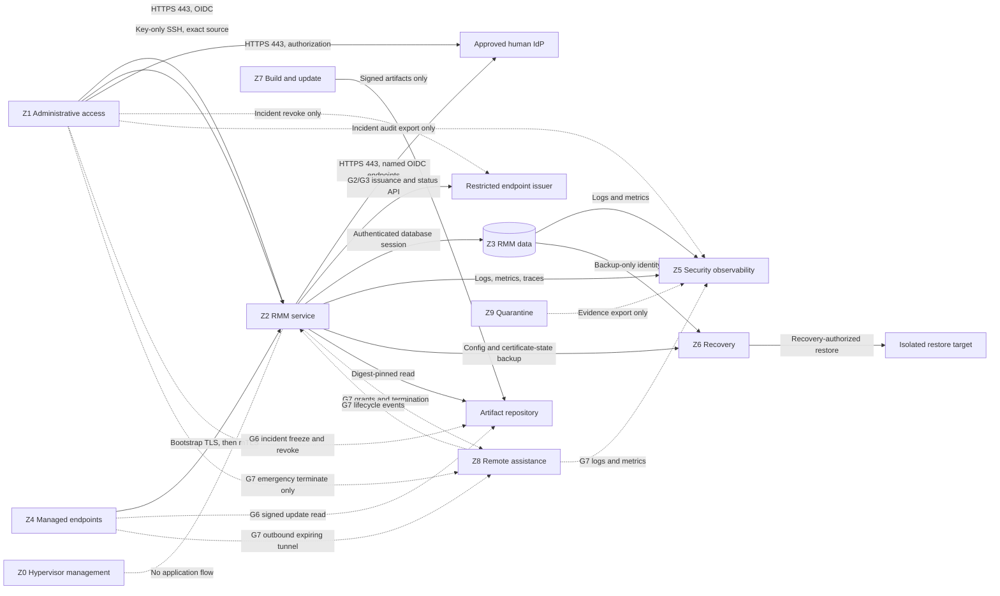

# RMM Infrastructure and Microsegmentation Specification

## Purpose and status

This document defines the infrastructure required to operate NorthGate RMM and
the provisioning controls required to isolate the platform from operators,
managed endpoints, build systems, backups, and future remote-access services.

This is a design and acceptance specification. It does **not** authorize a VM,
VLAN, virtual switch, firewall rule, DNS record, certificate, endpoint agent, or
public listener. Infrastructure deployment remains subject to the phase gates in
[Authorization Gates](../governance/AUTHORIZATION_GATES.md).

Terminology: this specification covers the NorthGate remote monitoring and
management (**RMM**) platform. It does not describe the NIST Risk Management
Framework, which is commonly abbreviated **RMF**.

## Security basis

Network location is a containment signal, not an identity or authorization
decision. Every permitted flow also requires an authenticated workload, human,
or endpoint identity and a resource-level authorization decision. This follows
the resource-focused model in [NIST SP 800-207](https://csrc.nist.gov/pubs/sp/800/207/final)
and the identity-aware application model in
[NIST SP 800-207A](https://csrc.nist.gov/pubs/sp/800/207/a/final).

The virtual-network design applies segmentation, firewall traffic control, and
traffic monitoring as recommended by
[NIST SP 800-125B](https://csrc.nist.gov/pubs/sp/800/125/b/final). Provisioning is
incremental and evidence-driven, consistent with CISA's
[Microsegmentation in Zero Trust guidance](https://www.cisa.gov/news-events/alerts/2025/07/29/cisa-releases-part-one-zero-trust-microsegmentation-guidance)
and the implementation lessons in
[NIST SP 1800-35](https://csrc.nist.gov/pubs/sp/1800/35/final).

## Design principles

1. Deny traffic by default at routed, guest-host, and application boundaries.
2. Allow only a named source identity to a named destination service and port.
3. Agents initiate outbound connections; endpoints expose no RMM listener.
4. The Hyper-V management plane never shares the RMM application plane.
5. Operator ingress and agent ingress have different authentication, policy,
   rate-limit, and logging paths even when they initially share one VM.
6. PostgreSQL, signing keys, backups, and remote-session credentials are never
   reachable from a managed-endpoint segment.
7. A VLAN or subnet does not grant access. mTLS, OIDC, service credentials, and
   resource authorization remain mandatory.
8. IPv4 and IPv6 receive equivalent policy; an unfiltered secondary protocol is
   a failed deployment.
9. Management access uses the approved NorthGate administrative path, never an
   application listener or endpoint tunnel.
10. Every rule has an owner, purpose, expiry/review date, evidence, and rollback.

## Required platform capabilities

The RMM platform requires the following capabilities. A capability may share the
initial private control-plane VM only where the table permits it.

| Capability                            | Phase 1 placement                   | Separation requirement                                                         |
| ------------------------------------- | ----------------------------------- | ------------------------------------------------------------------------------ |
| Reverse proxy and TLS ingress         | Control-plane VM, private only      | Separate agent and operator routes, policies, and rate limits                  |
| Operator UI and API                   | Control-plane VM                    | Private operator ingress; no endpoint-segment access                           |
| Agent gateway                         | Control-plane VM                    | Distinct service identity and listener policy from UI/API                      |
| Registry, policy, and job modules     | Control-plane VM                    | No direct external listener                                                    |
| Scheduler and workers                 | Control-plane VM                    | Separate runtime identity and least database privilege                         |
| PostgreSQL                            | Local authenticated service         | Dedicated data VM only after measured trust, availability, or capacity trigger |
| Audit writer                          | Control-plane VM                    | Append role plus independent protected copy and incident export before G2      |
| Logs, metrics, and traces             | Local buffer plus central sink      | Central sink must not become an RMM control path                               |
| Endpoint certificate authority        | Offline root plus restricted issuer | Root never resides on the online RMM VM                                        |
| Human identity provider               | Existing approved service           | RMM stores no reusable human password                                          |
| Runtime secret provider               | Host-protected references           | Never embedded in image, Git, logs, URLs, or manifests                         |
| Artifact repository                   | Read-only consumer path             | Build/upload identity remains outside the control plane                        |
| Backup and recovery store             | Separate recovery boundary          | No ordinary application write or delete authority                              |
| Session gateway and credential broker | Absent                              | Dedicated zone and hosts required at G7                                        |
| Build and release signing             | Absent from runtime                 | Dedicated build zone; signing offline or hardware-backed at G6                 |

The project deliberately does not require Kubernetes, a service mesh, Redis, or
a separate message broker for the initial lab deployment. PostgreSQL provides the
first durable job queue. Additional infrastructure requires measured need and an
architecture decision record.

## Compute and storage baseline

These values are initial planning envelopes, not production capacity claims.
They must be validated by Phase 1 tests and revised from observed utilization.

| Environment               | Compute                                              | Storage                                        | Intended scope                             |
| ------------------------- | ---------------------------------------------------- | ---------------------------------------------- | ------------------------------------------ |
| Developer workstation     | 2 vCPU, 4 GiB RAM                                    | 40 GiB disposable workspace                    | Synthetic fixtures and tests only          |
| Private lab control plane | 4 vCPU, 8 GiB RAM                                    | 80 GiB OS plus 100 GiB service-data disk       | Phase 1 and one Phase 2/3 canary           |
| Expanded lab              | 4-8 vCPU, 8-16 GiB RAM per measured role             | Separate database, audit, and recovery volumes | Only after a documented separation trigger |
| Production-intent         | Determined by load, recovery, and availability tests | Encrypted, monitored, capacity-managed storage | G8 only; no estimate from lab sizing       |

The control-plane VM must be a Generation 2 VM with Secure Boot where supported,
a virtual TPM when the selected secret-protection design requires it, fixed
asset identity, `destroyProtection: true`, and no checkpoints used as backup.
The preferred server OS is a minimal, currently supported Linux distribution.
Windows and Linux are both managed endpoint platforms; that does not require the
server itself to run on both.

Storage must provide:

- a dedicated service-data volume so database growth cannot exhaust the OS;
- encryption at rest with recovery keys held outside the VM;
- database-consistent backups plus configuration and certificate-state backup;
- capacity alerts before database, audit, spool, or backup failure;
- no shared writable mount between runtime, build, and recovery identities; and
- an isolated restore target for testing revocation and audit invariants.

## Availability and dependency baseline

Before the lab canary is installed, the platform needs:

- authoritative internal DNS with separate operator and agent service names;
- authenticated, monitored time synchronization;
- endpoint PKI with offline root, restricted online issuer, renewal, revocation,
  and documented clock-skew behavior;
- OIDC authentication with phishing-resistant MFA for privileged operators;
- tested database backup and isolated restore;
- central alert delivery that does not depend solely on the failed RMM service;
- a documented emergency-stop and certificate-revocation path; and
- recovery access independent of the normal UI and agent gateway.

Loss of DNS, time, PKI, identity provider, database, or storage must fail closed
for new privileged work and remain observable. Monitoring data may become stale;
the UI must never convert missing data into success.

## Trust zones

Zone names are stable logical roles. Exact VLAN IDs, subnets, switch names, and
IP addresses are deliberately absent until live NorthGate discovery and a
separately approved network-boundary plan establish them.

| Zone                      | Purpose                                      | Permitted residents                                           | Explicitly excluded                          |
| ------------------------- | -------------------------------------------- | ------------------------------------------------------------- | -------------------------------------------- |
| Z0 Hypervisor management  | Operate HC-HV01 and the VM Factory           | Hypervisor and approved management services                   | RMM workloads, agents, databases             |
| Z1 Administrative access  | Trusted operator entry                       | Hardened admin workstation or jump path                       | Managed endpoints and general user devices   |
| Z2 RMM service            | UI/API and agent gateway ingress             | Private proxy and control-plane runtime                       | Hypervisor management and release signing    |
| Z3 RMM data               | Database and protected audit data            | PostgreSQL and audit storage when separated                   | Operators, endpoints, build workers          |
| Z4 Managed endpoints      | Systems monitored by RMM                     | Approved Windows/Linux canaries, later scoped endpoint groups | Control-plane or management services         |
| Z5 Security observability | Independent logs, metrics, alerts            | Wazuh or another approved central sink                        | RMM administrative authority                 |
| Z6 Recovery               | Backups and isolated restore                 | Backup target and recovery operator path                      | Ordinary runtime write/delete identity       |
| Z7 Build and update       | CI, artifact creation, signing handoff       | Ephemeral builders and artifact publication                   | Production secrets and endpoint reachability |
| Z8 Remote assistance      | Future session gateway and credential broker | G7-authorized gateway services only                           | Standing routes to endpoint networks         |
| Z9 Quarantine             | Contain suspect or failed assets             | Isolated endpoint or restored copy under investigation        | Normal control-plane and peer reachability   |

Logical zones may initially share physical infrastructure, but enforcement points
must remain distinct. For example, Phase 1 can keep PostgreSQL on the control VM
while a local socket, database role, process identity, and guest firewall preserve
the future Z2-to-Z3 boundary.

## Minimum flow policy

All RMM-created inter-zone and external dependency flows not listed are denied.
Stateful return traffic is part of the initiating row and does not create a
second standing path. “Conditional” means the flow remains prohibited until its
named gate and design evidence exist.

| Source                                 | Destination                           | Service                     | Status          | Required control                                                           |
| -------------------------------------- | ------------------------------------- | --------------------------- | --------------- | -------------------------------------------------------------------------- |
| Z1 admin path                          | Z2 operator ingress                   | TCP 443                     | Required        | OIDC MFA, device/source policy, RBAC, audit                                |
| Z1 admin path                          | Z2 control-plane host                 | TCP 22                      | Required        | Exact source; dedicated key-only identity, no password/root login, audit   |
| Z1 browser                             | Approved human IdP                    | TCP 443                     | Required        | Authorization endpoint only; TLS and IdP policy                            |
| Z2 control plane                       | Approved human IdP                    | TCP 443                     | Required        | Named OIDC discovery, token, key, revocation/logout endpoints              |
| Z2 control plane                       | Approved endpoint issuer              | TCP 443                     | G2/G3           | Workload mTLS; named enrollment, issuance, renewal, revocation/status APIs |
| Z1 recovery operator                   | Endpoint issuer emergency revocation  | TCP 443                     | Incident only   | Dedicated MFA identity; revoke exact scope only, no issuance or renewal    |
| Z2 TLS service                         | Approved server PKI                   | TCP 443                     | Required        | Authenticated issuance, renewal, revocation/status endpoints only          |
| Z4 unenrolled canary                   | Z2 enrollment ingress                 | TCP 443                     | G2/G3           | Server-authenticated TLS; single-use exact-scope grant, key proof, limits  |
| Z4 enrolled endpoint                   | Z2 agent ingress                      | TCP 443                     | G2/G3           | Outbound mTLS, revocation, endpoint binding, rate and size limits          |
| Z2 application                         | Z3 PostgreSQL                         | TCP 5432 or local socket    | Required        | Named workload role, TLS if networked, least SQL privilege                 |
| Z2 services                            | Z5 telemetry sink                     | Approved TLS port           | Required        | Write-only service identity and bounded queue                              |
| Z3 data services                       | Z5 telemetry sink                     | Approved TLS port           | When separated  | Write-only service identity; no RMM control authority                      |
| Z5 telemetry service                   | Approved alert destination            | Approved TLS port           | Required        | Named destination, notification-only credential, bounded redacted payload  |
| Z1 incident auditor                    | Z5 protected audit export             | TCP 443                     | Incident/audit  | Independent MFA; read/export exact case and time range, no alter/delete    |
| Z3 database backup identity            | Z6 backup target                      | Approved backup protocol    | Required        | Separate credential, encryption, integrity, immutability/retention         |
| Z2 backup exporter                     | Z6 backup target                      | Approved backup protocol    | Required        | Config/certificate-state scope; write-only identity, no delete authority   |
| Z5 audit archive exporter              | Z6 backup target                      | Approved backup protocol    | Required        | Audit/checkpoint scope; write-only identity, immutable destination         |
| Z6 source-record collector             | Approved source/deployment repository | TCP 443                     | Required        | Read-only exact commit, signed tag, and deployment-manifest scope          |
| Artifact repository backup identity    | Z6 backup target                      | Approved backup protocol    | G6              | Metadata, SBOM, provenance, and public-key scope; no artifact publication  |
| Z8 metadata exporter                   | Z6 backup target                      | Approved backup protocol    | G7 conditional  | Encrypted session/gateway metadata only; write-only identity, no delete    |
| Approved secret-store recovery service | Dedicated secret recovery target      | Provider-approved mechanism | When present    | Separate authority, encryption, audit, retention, and restore test         |
| Z6 recovery service                    | Isolated restore target               | Approved restore protocol   | Recovery only   | Exact authorization, no endpoint/operator ingress, reconcile before use    |
| Z2 runtime                             | Artifact repository                   | TCP 443                     | G6              | Read-only, signed metadata, digest and expiry verification                 |
| Z4 enrolled endpoint                   | Artifact repository                   | TCP 443                     | G6              | Read-only signed update for the endpoint's assigned rollout ring           |
| Z7 publisher                           | Artifact repository                   | TCP 443                     | G6              | Separate publication identity; provenance and audit                        |
| Z1 release recovery operator           | Artifact emergency metadata API       | TCP 443                     | G6 incident     | Independent MFA; freeze/revoke only, offline-root authorization, no upload |
| Z2/Z3/Z5/Z6/Z8 host updaters           | Approved OS repositories              | TCP 443                     | Maintenance     | Separate exact-source rules; named repositories, signatures, change window |
| Z7 builder                             | Approved source/dependency registries | TCP 443                     | G6              | Read-only locked inputs, digest/provenance checks, no runtime secrets      |
| Z7 builder                             | Approved CI workload IdP              | TCP 443                     | G6              | Ephemeral workload identity with exact audience and short expiry           |
| Z1 recovery path                       | Z6 recovery service                   | Approved admin protocol     | Required        | Recovery role, MFA, reason, alert, evidence                                |
| Z1 network recovery operator           | Approved firewall/PEP management      | Approved admin protocol     | Incident/change | Independent MFA; exact device and rules, audit, expiry, tested rollback    |
| Z2 control plane                       | Internal DNS and time                 | UDP/TCP 53; approved NTP    | Required        | Named servers only; monitor failure and drift                              |
| Z3/Z5/Z6/Z7/Z8 service hosts           | Internal DNS and time                 | UDP/TCP 53; approved NTP    | When present    | Separate exact-source rules to named servers; monitor failure and drift    |
| Z4 endpoint                            | Internal DNS and time                 | Existing approved services  | G2/G3           | No new broad route created by RMM                                          |
| Z1 admin path                          | Z0 hypervisor management              | Existing approved path      | Existing        | Separate identity; never transits RMM service                              |
| Z1 browser                             | Z8 session gateway                    | TCP 443                     | G7 conditional  | Single-use grant, timeout, recording/privacy policy                        |
| Z1 recovery operator                   | Z8 emergency termination API          | TCP 443                     | G7 conditional  | Dedicated MFA identity; terminate/revoke only, no session creation         |
| Z2 control plane                       | Z8 gateway control API                | TCP 443                     | G7 conditional  | Workload mTLS; signed one-session grant, revoke, and force termination     |
| Z8 session gateway                     | Z2 event ingress                      | TCP 443                     | G7 conditional  | Workload mTLS; bounded lifecycle events, no job or policy authority        |
| Z8 session gateway                     | Z8 credential broker                  | Authenticated IPC or mTLS   | G7 conditional  | One-session retrieval; credential never reaches browser or RMM database    |
| Z8 credential broker                   | Approved OS identity authority        | Approved identity protocol  | G7 conditional  | JIT credential for one actor, endpoint, protocol, and expiry               |
| Z8 session gateway                     | Z5 telemetry sink                     | Approved TLS port           | G7 conditional  | Write-only security and availability telemetry                             |
| Z4 exact endpoint                      | Z8 session gateway                    | Outbound expiring tunnel    | G7 conditional  | Stateful return only; one protocol, port, grant, and expiry                |
| Z9 quarantined asset                   | Z5 evidence intake                    | Approved evidence protocol  | Incident only   | Exact source, write-only bounded export, expiry, malware-safe handling     |

Every Z1 incident/recovery route uses an identity and credential stored outside
the ordinary RMM control plane and, when the primary IdP is in scope for the
incident, an independently authenticated recovery method. These identities are
disabled or access-restricted when not in use, cannot perform ordinary RMM work,
and require reason, alerting, short expiry, and retrospective review.

### Backup coverage

The backup specification is satisfied through bounded, artifact-specific
mechanisms rather than one broadly privileged application backup account.

| Required recovery material                                                                              | Authoritative source and bounded mechanism                                                                                                                                      | Protected destination            | Activation                        |
| ------------------------------------------------------------------------------------------------------- | ------------------------------------------------------------------------------------------------------------------------------------------------------------------------------- | -------------------------------- | --------------------------------- |
| PostgreSQL data, schema, endpoint identity/revocation state, authorization policy, and phase-gate state | Z3 database backup identity performs a database-consistent export                                                                                                               | Z6 backup target                 | Required                          |
| Audit events and integrity checkpoints                                                                  | Z5 protected audit archive exports append-only records and checkpoints                                                                                                          | Z6 immutable backup set          | Required before G2                |
| Configuration and certificate state, excluding plaintext secrets                                        | Z2 backup exporter writes an encrypted, schema-versioned bundle                                                                                                                 | Z6 backup target                 | Required                          |
| Source commit and deployment manifests                                                                  | Z6 collector reads only the exact commit/tag and deployment records named by the recovery set                                                                                   | Z6 signed recovery catalog       | Required                          |
| Update metadata, SBOMs, provenance, and public verification keys                                        | Artifact-repository backup identity exports only release metadata and trust material; it cannot publish or revoke                                                               | Z6 immutable backup set          | G6                                |
| Gateway and session metadata                                                                            | Z8 exporter encrypts the bounded metadata set before write-only transfer                                                                                                        | Z6 backup target                 | G7                                |
| Secret-store state                                                                                      | The approved secret provider's recovery service uses its own separate backup authority and destination; no RMM runtime, Z2 exporter, or Z6 collector receives plaintext secrets | Dedicated secret recovery target | When a secret store is introduced |

Each recovery set records source identity, content manifest, schema/version,
encryption key reference, digest or signature, retention class, and restore-test
result. A gate cannot open until every recovery mechanism activated by that gate
has a successful negative authorization test and an isolated restore test. The
online RMM runtime cannot alter retention or delete all copies.

### Explicit deny tests

Provisioning is unacceptable unless testing proves that:

- Z4 cannot initiate connections to Z0, Z1, Z3, Z6, or Z7;
- an unenrolled Z4 canary cannot use enrollment TLS without a valid single-use
  grant and proof of possession for its newly generated key;
- Z1 cannot connect directly to Z3 or use the agent ingress path;
- Z2 cannot administer the hypervisor or publish/sign releases;
- the Z1 recovery identity cannot create, extend, view, or join a Z8 session;
- the Z1 recovery identity cannot issue or renew endpoint certificates;
- the incident auditor cannot alter/delete evidence or exercise RMM authority;
- the release-recovery identity cannot upload an artifact or resume a frozen
  rollout without separately authorized, valid update metadata;
- Z5 cannot issue RMM jobs or alter RMM policy;
- Z6 cannot become a general application or endpoint share;
- one Z4 endpoint cannot reach another through RMM-created network paths;
- a quarantined asset cannot reach Z2 except through an explicitly approved,
  time-bounded evidence path; and
- equivalent IPv6 tests do not reveal a path denied only for IPv4.

## Enforcement layers

Microsegmentation requires several independent policy-enforcement points:

1. **Routed boundary:** OPNsense or the approved firewall enforces inter-zone
   default deny, stateful allow rules, logging, and anti-spoofing.
2. **Virtualization boundary:** Hyper-V switch/VLAN configuration attaches each
   vNIC to exactly one approved network profile. A workload VM is not multi-homed
   merely to avoid routing policy.
3. **Guest boundary:** Linux nftables/firewalld or Windows Defender Firewall
   allows only the service listeners and approved management source.
4. **Transport boundary:** TLS protects operator traffic; mTLS binds agent and
   workload connections to issued identities.
5. **Application boundary:** OIDC, RBAC/ABAC, endpoint identity, target scope,
   phase gate, action type, and expiry are evaluated for every request.
6. **Data boundary:** PostgreSQL roles separate migrations, runtime reads/writes,
   scheduler claims, audit append, backup, and read-only audit export.
7. **Recovery boundary:** backup retention and deletion authority are not held by
   the ordinary RMM runtime identity.

No single layer is accepted as proof of isolation. Firewall policy cannot replace
service identity, and mTLS cannot replace an inter-zone deny rule.

## Provisioning specification

### 1. Discover and reserve

Before authoring a deployable plan:

- reconcile current Hyper-V, virtual-switch, OPNsense, DNS, DHCP/IPAM, storage,
  identity, Wazuh, backup, and VM Factory state;
- assign immutable asset IDs, owners, purposes, classifications, criticality,
  lifecycle/review dates, and recovery objectives;
- measure host CPU, memory, storage headroom, and current network dependencies;
- identify the exact supported Linux server image and immutable digest; and
- record every unresolved value as `TBD after live discovery`, never an invented
  VLAN, subnet, switch, address, rule, or credential.

### 2. Create reviewed network profiles

Create opaque VM Factory network-profile IDs for approved zones. A VM manifest
references only the profile ID; raw switch names, VLAN IDs, addresses, routes, or
firewall commands do not enter the VM manifest.

Creating or changing a virtual switch, VLAN trunk, OPNsense interface, route,
NAT policy, or host firewall is a material network-boundary change. It requires a
separate reviewed plan, exact targets, before-state export, recovery path, and
explicit authorization. A merged VM manifest is not that authorization.

### 3. Provision the control-plane VM

The VM Factory plan must resolve:

- unique asset ID and uppercase VM name;
- Generation 2, approved Secure Boot template, and `destroyProtection: true`;
- approved image, firmware, compute, storage, network, bootstrap, owner, and
  recovery profile IDs;
- one vNIC attached only to Z2;
- separate OS and service-data storage;
- no embedded secret, command, script, URL, raw path, switch, or credential; and
- a stable change/request ID joining plan, execution, validation, and evidence.

Provision only after factory policy, promoted-image, capacity, collision,
rollback, and authorization checks pass. Boot success alone is not acceptance.

### 4. Harden the operating system

- install only required packages from approved repositories;
- enable automatic security-update notification and a controlled patch window;
- use key-only, source-restricted administrative access through Z1;
- disable password SSH, direct root login, unused services, and unused protocols;
- apply host firewall default deny and confirm the effective listener inventory;
- protect service identities, configuration, keys, and logs with least privilege;
- enable secure audit logging, time sync, disk/capacity monitoring, and EDR/SIEM
  coverage where supported; and
- capture a sanitized configuration baseline and recovery method.

### 5. Provision identity and cryptography

- establish offline root and restricted online issuing roles;
- issue separate certificates for agent gateway, workload-to-database, and other
  service identities rather than reusing the HTTPS certificate;
- configure short validity, renewal, revocation, and emergency rollover;
- integrate operator OIDC and MFA without storing reusable passwords;
- deliver runtime secrets by protected reference after VM creation; and
- verify that secrets do not appear in VM metadata, process arguments, logs,
  traces, repository history, support bundles, or backups without encryption.

### 6. Deploy application and data services

- bind operator and agent ingress separately, even on the same address;
- bind internal modules to loopback or authenticated local IPC unless separated;
- bind PostgreSQL to loopback/local socket in the single-VM topology;
- apply migration, runtime, scheduler, audit, backup, and export database roles;
- configure bounded queues, rate limits, payload limits, retention, and disk
  thresholds; and
- export logs/metrics/traces to Z5 without granting Z5 operational authority.

### 7. Apply and test segmentation

Rules are introduced disabled or in a maintenance window, reviewed for shadowed
or overly broad objects, then tested from an actual source in each affected zone.
Record both allowed-flow success and denied-flow failure. A port scan alone is not
enough; validate certificate, identity, authorization, and audit behavior.

### 8. Admit one canary

Only G2 or G3 authorizes a disposable endpoint canary. Enroll one exact asset,
confirm no inbound agent listener, validate outbound mTLS and revocation, then
test isolation from all non-required zones. Do not widen a source subnet merely
because the canary's identity or addressing is inconvenient.

### 9. Establish recovery and operations

- execute a database-consistent backup and isolated restore;
- prove that revoked endpoints remain revoked after restoration;
- exercise DNS, time, PKI, database, telemetry, and firewall failure behavior;
- alert on policy change, deny spikes, unexpected listeners, certificate failure,
  storage thresholds, stale endpoints, and backup failure;
- assign rule review and certificate-renewal owners; and
- preserve a tested emergency isolation and rollback procedure.

## Acceptance evidence

The deployment change packet must contain:

- current topology and data-flow diagrams;
- zone, asset, network-profile, rule, and owner inventories;
- exact before/after firewall and virtual-network configuration exports;
- positive connectivity results for every flow activated by the current change;
- negative results for inactive conditional rows and every expected deny;
- guest listener and host-firewall inventory;
- TLS/mTLS identity, expiry, and revocation test results without private keys;
- database-role and unauthorized-access tests;
- agent no-listener and cross-endpoint isolation evidence;
- backup/restore and revocation-invariant results;
- capacity baseline and alert tests;
- rollback result or verified rollback readiness;
- VM Factory plan, approval, receipt, and commit/tree identity where applicable;
- Operation-SeeSaw asset, infrastructure, security, risk, and evidence links; and
- an explicit list of residual risk, exceptions, expiry dates, and owners.

## Rollback and containment

Before activation, preserve firewall, OPNsense, switch, DNS, certificate, service,
database, and VM configuration needed to restore the known-good state.

Rollback order is dependency-aware:

1. stop new enrollment, jobs, and session creation;
2. revoke affected grants or certificates;
3. disable the newly introduced allow rule while preserving Z1 recovery access;
4. stop affected application listeners;
5. restore the last known-good network and service configuration;
6. verify that no unintended route or listener remains; and
7. reconcile data and audit evidence before reopening service.

Suspected compromise uses Z9 quarantine rather than deletion. Preserve evidence,
do not attach the suspect VM to a normal endpoint or management zone, and do not
restore network access until identity and persistence are re-established.

## Phase boundaries

| Gate | Infrastructure effect                                               |
| ---- | ------------------------------------------------------------------- |
| G1   | Documentation, simulation, and local private services only          |
| G2   | One named Linux canary may use the Z4-to-Z2 outbound path           |
| G3   | One named Windows canary may use the same bounded path              |
| G4   | Typed read-only job flow; no arbitrary command or new network route |
| G5   | Named remediation only; helper and rollback boundaries required     |
| G6   | Z7 artifact/update path and signing separation may be activated     |
| G7   | Dedicated Z8 gateway, credential broker, and expiring tunnel path   |
| G8   | Production or external exposure only after independent assessment   |

At the current G1 state, this document can guide local simulation and planning.
It does not open agent, network, remote-access, or production deployment gates.

## Decisions still required before deployment

The following values require live discovery or owner decisions:

- exact NorthGate asset ID and VM name;
- supported Linux distribution and release;
- VM Factory image, compute, storage, network, bootstrap, and recovery profiles;
- physical/virtual switch and OPNsense implementation for each logical zone;
- VLAN IDs, subnets, DNS names, static/reserved addresses, and IPv6 policy;
- identity provider, endpoint issuer, secret provider, and certificate lifetimes;
- backup platform, retention, immutability, RPO, and RTO;
- telemetry destination, retention, alerts, and on-call destination;
- data retention/classification for inventory, job results, and audit records; and
- future external access, availability, and scale objectives.

These are not safe defaults to invent in a repository document. They become
approved values only through live reconciliation, risk review, and a bounded
change packet.
