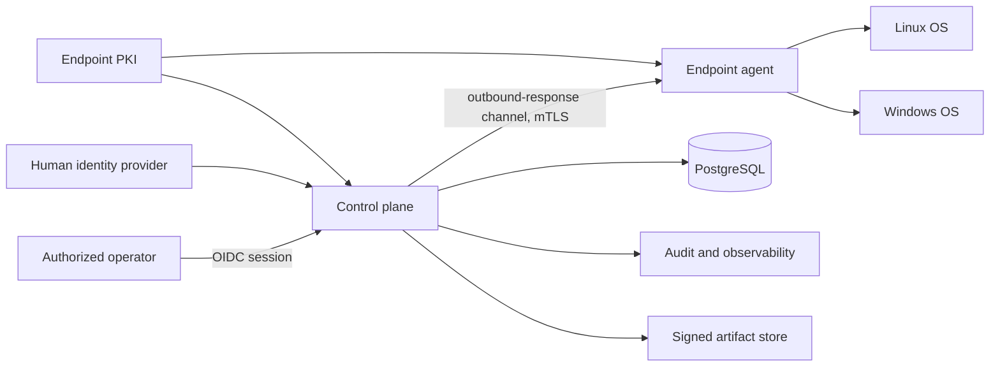
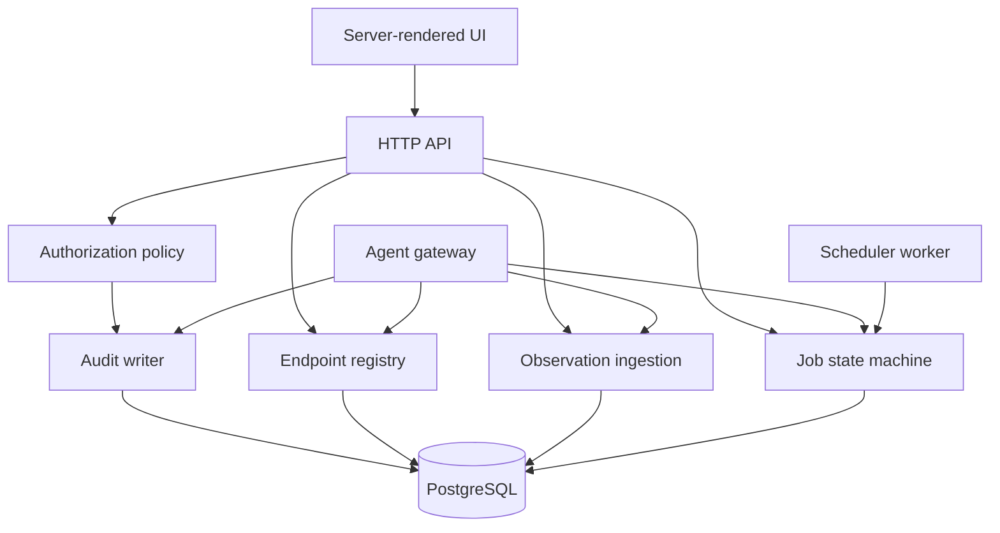

# Architecture Overview

## System objective

NorthGate RMM is a privileged distributed system that converts authenticated
endpoint observations and authorized operator intent into bounded, auditable
work. The initial architecture is a modular monolith so trust boundaries are
explicit without premature deployment complexity.

## Context

The initial deployment is private and lab-only. Agents initiate outbound
connections; managed endpoints expose no RMM listener.

## Trust domains

1. **Operator plane:** UI, human authentication, session, role, and approval.
2. **Control plane:** API, registry, policy, scheduler, ingestion, and audit.
3. **Agent gateway:** endpoint authentication, rate limits, revocation, message
   validation, delivery, and result ingestion.
4. **Data plane:** relational records, observations, audit, artifacts, backup.
5. **Endpoint plane:** unprivileged core, local identity, collectors, spool, and
   future separately authorized privileged helper.
6. **Build/update plane:** isolated build, signing, provenance, SBOM, release, and
   staged distribution.

Compromise in one domain must not automatically grant the authority of another.

## Initial container/module boundaries

Module calls use typed internal interfaces. Database tables are not a substitute
for authorization boundaries.

## Control and data flows

- [Agent protocol](PROTOCOL.md)
- [Data model](DATA_MODEL.md)
- [Deployment model](DEPLOYMENT.md)
- [Remote access architecture](REMOTE_ACCESS.md)
- [Authorization model](../security/AUTHORIZATION_MODEL.md)
- [Cryptography and keys](../security/CRYPTOGRAPHY_AND_KEYS.md)

## Architecture qualities

Priority order for the initial phases:

1. security and containment;
2. correctness and honest state;
3. recoverability and auditability;
4. operability and diagnosability;
5. compatibility;
6. performance;
7. feature breadth.

## Prohibited shortcuts

- hostname or IP address as authorization identity;
- long-lived shared enrollment tokens;
- arbitrary command strings as actions;
- database write access from endpoint agents;
- automatic success when results are missing;
- release/update signing from the online application service;
- secrets in URLs, command lines, logs, traces, fixtures, or audit payloads;
- cross-module authorization assumed because code runs in one process.
- direct operator-to-endpoint remote sessions that bypass the session gateway.
