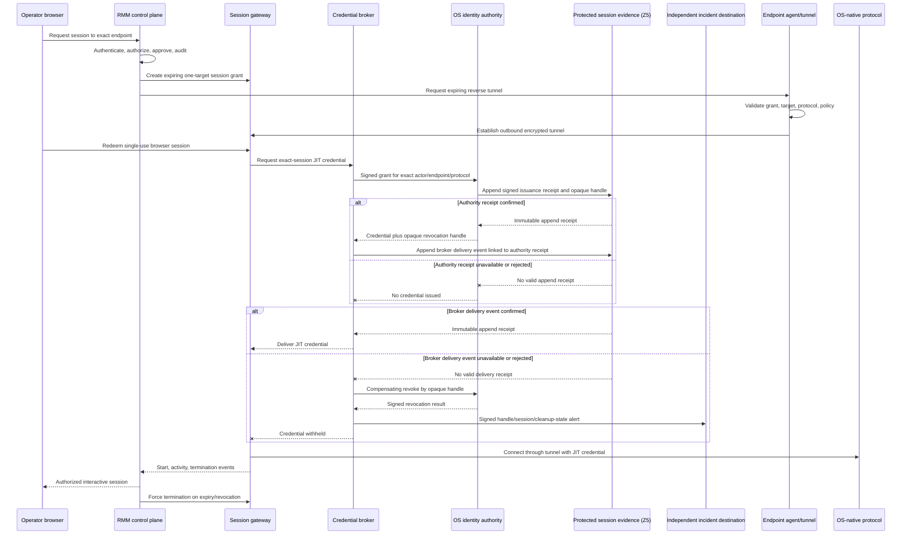

# Cross-Platform Remote Access Architecture

## Required outcome

Authorized operators can open interactive sessions to supported Windows and Linux
endpoints without exposing endpoint management ports to operator networks, sharing
durable endpoint passwords, or turning the core RMM agent into an unrestricted
remote-control channel.

## Chosen pattern

Use an isolated browser-accessible session gateway based on Apache Guacamole or an
equivalently reviewed free-software gateway. It brokers established OS-native
protocols:

- Windows desktop: RDP;
- Linux terminal: SSH;
- Linux desktop: qualified RDP, VNC, or Wayland-native service;
- Windows terminal: OpenSSH or a separately approved constrained PowerShell path.

The RMM control plane authorizes sessions but does not proxy desktop pixels or
terminal streams itself.

## Trust separation

- human identity provider authenticates the operator;
- RMM policy decides whether the actor may request and approve a session;
- session gateway handles interactive protocol translation;
- tunnel broker limits connectivity to one endpoint, protocol, port, and expiry;
- credential broker issues or retrieves a just-in-time credential without exposing
  it to the browser and may revoke only that session-issued credential by its
  returned opaque handle;
- endpoint agent authorizes only the tunnel capability, not arbitrary local
  socket forwarding;
- audit service records lifecycle metadata independently of the gateway.

## Session authorization

Every session grant binds:

- operator and approver identities;
- endpoint cryptographic ID;
- protocol and local destination;
- allowed capabilities;
- creation, not-before, idle timeout, absolute expiry;
- reason/ticket;
- source administrative zone;
- recording/transcript policy;
- immutable policy and request digests;
- single-use redemption and revocation ID.

Authorization is rechecked at request, approval, tunnel establishment, browser
redemption, and reconnect. An open UI page is not authorization to reconnect.
Z8 also revalidates the exact operator subject, IdP session, and client directly
with the IdP at least every 60 seconds during an active session. Revoked, unknown,
unavailable, or stale status closes the browser stream and endpoint tunnel and
starts exact JIT-credential revocation without waiting for Z2.

## Default-denied capabilities

- clipboard synchronization;
- file upload/download;
- drive, printer, smart-card, USB, camera, microphone, and audio redirection;
- credential saving;
- concurrent viewers;
- unattended persistent tunnels;
- arbitrary destination/port forwarding;
- session sharing by URL.

Each future capability requires a separate threat-model and policy decision.

## Credentials

Preferred order:

1. short-lived SSH certificates for terminal access;
2. short-lived or just-in-time OS account credentials held only by a credential
   broker and gateway;
3. no shared administrator passwords stored in the RMM database;
4. no credential material delivered to browser JavaScript or session recordings.

Credential issuance and revocation are separate from endpoint enrollment keys.
The broker's workload identity cannot enumerate or inspect credentials, revoke a
credential from another session/grant, or change OS identity policy. The OS
identity authority enforces the exact session/grant/opaque-handle binding.
Every credential profile must enforce revocation at the endpoint through online
authority validation or the signed, monotonically versioned KRL/status mechanism
defined in the
[infrastructure specification](INFRASTRUCTURE_AND_MICROSEGMENTATION.md#jit-credential-revocation-propagation).
A profile that relies only on credential expiry is not eligible for G7.

## Linux desktop variability

Linux does not provide one universal desktop protocol. Support is declared per
distribution, display stack, desktop environment, and selected backend. Headless
Linux can be terminal-only. Wayland security behavior, session ownership, display
manager integration, and user consent require explicit qualification.

## Session evidence and privacy

Always record metadata: requester, approver, endpoint, protocol, source zone,
start/end, termination reason, policy, gateway/tunnel IDs, capability flags,
credential issuer, and an opaque non-secret credential/revocation identifier.
The OS identity authority validates the signed session grant and appends its own
signed issuance receipt and identifier directly to protected Z5 evidence before
returning credential material or the handle to Z8. The broker then appends a
separate delivery event linked to the authority receipt before releasing the
credential to the gateway. Failure of either append fails session establishment
closed, so a compromised broker cannot be the sole source of the recovery handle.

If the broker delivery append fails after issuance, the broker retains the
non-secret handle, performs compensating revocation, and verifies the authority's
revocation receipt before discarding the handle. If cleanup cannot be confirmed,
it sends a signed, bounded alert containing issuer, handle, session/grant, and
cleanup state directly to the approved independent incident destination; the
alert contains no credential secret. It also retains a host-protected
pending-revocation record for retry and operator reconciliation.

Independent emergency termination does not rely on the Z8-to-Z2 lifecycle path.
The Z1 recovery client appends signed intent and observed/result evidence to Z5
before and after the action (or Z6 when Z5 is unavailable), and the gateway sends
its signed termination event directly to protected Z5 session evidence. Evidence
distinguishes gateway-claimed outcome from independently observed teardown.

Screen recording and terminal transcription are not universally enabled. The
project must decide retention, access, notification, redaction, and legal/privacy
requirements before activation. Sensitive fields and credentials must never be
recorded intentionally.

## Failure and containment

- gateway, agent, or control-plane loss closes or expires the tunnel;
- revoking operator, endpoint, or session terminates active access;
- session gateway has no standing network route to arbitrary endpoints;
- tunnel allowlist prevents loopback/service pivoting beyond the approved target;
- reconnect requires a current authorization decision;
- failed Z5 issuance evidence triggers verified compensating credential
  revocation; unconfirmed cleanup produces an independent incident alert and a
  retained pending-revocation record;
- emergency stop terminates all sessions without relying on the compromised
  component under investigation;
- recordings and session logs are protected as sensitive evidence.

## Implementation gate

Remote access begins only in Phase 7 after monitoring, identity, audit, typed-job,
packaging, update, and recovery foundations pass their prior gates. This document
defines a required destination, not authorization to deploy remote sessions now.
